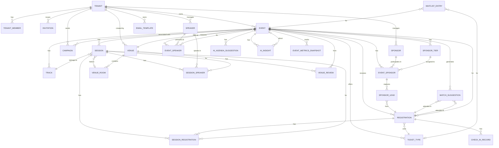

# Domain Model — EventFlow

> **Version**: 1.0 | **Status**: Approved for Implementation
> Architecture follows DDD tactical patterns with MediatR CQRS. All business logic lives exclusively in MediatR handlers. Zero business logic in controllers, repositories, or domain services unless they are pure domain logic (invariant enforcement on aggregates).

---

## Table of Contents

1. [Bounded Contexts](#1-bounded-contexts)
2. [Domain Entities & Aggregates](#2-domain-entities--aggregates)
3. [Domain Events](#3-domain-events)
4. [Value Objects](#4-value-objects)
5. [Entity Relationship Diagram](#5-entity-relationship-diagram)
6. [Commands (Write Operations)](#6-commands-write-operations)
7. [Queries (Read Operations)](#7-queries-read-operations)
8. [File Structure](#8-file-structure)

---

## 1. Bounded Contexts

EventFlow is deployed as a **modular monolith** (per ADR-002 assumptions for the mid-market scale). Each bounded context maps to a top-level folder under `src/Application/` and `src/Domain/`. Contexts communicate via domain events published to Redis Streams — never via direct coupling.

```
┌─────────────────────────────────────────────────────────────────────────┐
│                         EventFlow Bounded Contexts                      │
├─────────────────┬─────────────────┬──────────────────┬─────────────────┤
│   Identity &    │   Event         │   Attendee &     │   Communications│
│   Tenancy       │   Management    │   Registration   │   & Campaigns   │
│                 │                 │                  │                 │
│  Tenant         │  Event          │  Attendee        │  Campaign       │
│  UserProfile    │  Session        │  Registration    │  EmailTemplate  │
│  Role           │  Track          │  Ticket          │  SmsMessage     │
│  Permission     │  Agenda         │  CheckIn         │  Notification   │
│  Invitation     │  Speaker        │  Waitlist        │                 │
├─────────────────┼─────────────────┼──────────────────┼─────────────────┤
│   Venue &       │   Sponsorship   │   Analytics &    │   AI &          │
│   Logistics     │                 │   Reporting      │   Matchmaking   │
│                 │  Sponsor        │                  │                 │
│  Venue          │  SponsorTier    │  EventMetrics    │  AIAgendaSugg.  │
│  VenueRoom      │  SponsorPackage │  AttendeeJourney │  MatchSuggestion│
│  VenueReview    │  SponsorLead    │  CampaignMetrics │  AIInsight      │
│  VenueContract  │                 │  ROIReport       │                 │
└─────────────────┴─────────────────┴──────────────────┴─────────────────┘
```

**Context Integration Points** (via Redis Streams):
- `EventManagement → Attendee`: `EventPublishedEvent` triggers registration page activation
- `Attendee → Communications`: `AttendeeRegisteredEvent` triggers confirmation email
- `Attendee → Analytics`: `CheckInCompletedEvent` feeds real-time metrics
- `EventManagement → AI`: `EventCreatedEvent` triggers AI agenda suggestion generation
- `Communications → Analytics`: `CampaignSentEvent`, `EmailOpenedEvent` feed campaign metrics

---

## 2. Domain Entities & Aggregates

### 2.1 Identity & Tenancy Context

#### `Tenant` (Aggregate Root)
```csharp
public class Tenant : AggregateRoot<Guid>
{
    public string Name { get; private set; }             // "Acme Corp"
    public string Slug { get; private set; }             // "acme-corp" (URL-safe)
    public string? CustomDomain { get; private set; }   // "events.acmecorp.com"
    public TenantStatus Status { get; private set; }    // Active, Suspended, Trial
    public TenantPlan Plan { get; private set; }        // Starter, Growth, Enterprise
    public TenantTheme Theme { get; private set; }      // Value object
    public BillingInfo Billing { get; private set; }   // Value object
    public int MaxEventsPerYear { get; private set; }
    public int MaxAttendeesPerEvent { get; private set; }
    public DateTimeOffset CreatedAt { get; private set; }
    public DateTimeOffset? TrialEndsAt { get; private set; }
    public IReadOnlyList<TenantMember> Members { get; private set; }
    // Enforces: slug uniqueness, plan limits, domain validation
}

public enum TenantStatus { Trial, Active, Suspended, Cancelled }
public enum TenantPlan { Starter, Growth, Enterprise }
```

#### `TenantMember` (Entity — child of Tenant)
```csharp
public class TenantMember : Entity<Guid>
{
    public Guid TenantId { get; private set; }
    public string KeycloakUserId { get; private set; }  // Sub claim from Keycloak
    public string Email { get; private set; }
    public string FirstName { get; private set; }
    public string LastName { get; private set; }
    public TenantRole Role { get; private set; }        // Owner, Admin, EventManager, Viewer, CheckInStaff
    public MemberStatus Status { get; private set; }   // Active, Invited, Suspended
    public DateTimeOffset JoinedAt { get; private set; }
    public DateTimeOffset? LastActiveAt { get; private set; }
}

public enum TenantRole { Owner, Admin, EventManager, Viewer, CheckInStaff }
public enum MemberStatus { Active, Invited, Suspended }
```

#### `Invitation` (Aggregate Root)
```csharp
public class Invitation : AggregateRoot<Guid>
{
    public Guid TenantId { get; private set; }
    public string Email { get; private set; }
    public TenantRole Role { get; private set; }
    public string Token { get; private set; }           // Secure random token
    public Guid InvitedByUserId { get; private set; }
    public InvitationStatus Status { get; private set; } // Pending, Accepted, Expired, Revoked
    public DateTimeOffset ExpiresAt { get; private set; }
    public DateTimeOffset CreatedAt { get; private set; }
}

public enum InvitationStatus { Pending, Accepted, Expired, Revoked }
```

---

### 2.2 Event Management Context

#### `Event` (Aggregate Root) — PRIMARY AGGREGATE
```csharp
public class Event : AggregateRoot<Guid>
{
    public Guid TenantId { get; private set; }
    public string Name { get; private set; }             // "Q4 Sales Kickoff 2025"
    public string Slug { get; private set; }             // "q4-sales-kickoff-2025"
    public string? Description { get; private set; }    // Markdown
    public EventType Type { get; private set; }         // Conference, Webinar, Workshop, Offsite, Meetup, ProductLaunch
    public EventFormat Format { get; private set; }     // InPerson, Virtual, Hybrid
    public EventStatus Status { get; private set; }     // Draft, Published, Live, Completed, Cancelled
    public DateTimeOffset StartDateUtc { get; private set; }
    public DateTimeOffset EndDateUtc { get; private set; }
    public string? TimeZoneId { get; private set; }     // "America/Chicago"
    public int Capacity { get; private set; }
    public bool IsPublic { get; private set; }
    public bool RequiresApproval { get; private set; }  // Manual registration approval
    public Guid? VenueId { get; private set; }          // FK to Venue aggregate
    public string? VirtualMeetingUrl { get; private set; }
    public Guid CreatedByUserId { get; private set; }
    public DateTimeOffset CreatedAt { get; private set; }
    public DateTimeOffset UpdatedAt { get; private set; }
    public string? CoverImageUrl { get; private set; }
    public string? BannerImageUrl { get; private set; }
    public EventSettings Settings { get; private set; }  // Value object
    public RegistrationSettings Registration { get; private set; }  // Value object
    public IReadOnlyList<EventTag> Tags { get; private set; }
    public IReadOnlyList<Session> Sessions { get; private set; }    // Owned collection
    public IReadOnlyList<Track> Tracks { get; private set; }        // Owned collection
    public IReadOnlyList<TicketType> TicketTypes { get; private set; }  // Owned collection
    public IReadOnlyList<EventSpeaker> Speakers { get; private set; }   // Link table
    public IReadOnlyList<SponsorTier> SponsorTiers { get; private set; } // Owned
    // Domain invariants enforced here:
    // - EndDate must be after StartDate
    // - Capacity must be > 0
    // - Cannot publish without at least one ticket type
    // - Cannot cancel a Live event without explicit override flag
}

public enum EventType { Conference, Webinar, Workshop, Offsite, Meetup, ProductLaunch, TradeShow, Other }
public enum EventFormat { InPerson, Virtual, Hybrid }
public enum EventStatus { Draft, Published, Live, Completed, Cancelled }
```

#### `Session` (Entity — child of Event aggregate)
```csharp
public class Session : Entity<Guid>
{
    public Guid EventId { get; private set; }
    public Guid? TrackId { get; private set; }
    public string Title { get; private set; }
    public string? Description { get; private set; }     // Markdown
    public SessionType Type { get; private set; }        // Keynote, Breakout, Panel, Workshop, Networking, Break
    public DateTimeOffset StartTimeUtc { get; private set; }
    public DateTimeOffset EndTimeUtc { get; private set; }
    public int? CapacityOverride { get; private set; }   // Null = uses Event capacity
    public int SortOrder { get; private set; }
    public bool IsPublished { get; private set; }
    public string? RecordingUrl { get; private set; }
    public string? SlidesUrl { get; private set; }
    public string? VirtualRoomUrl { get; private set; }
    public Guid? VenueRoomId { get; private set; }
    public IReadOnlyList<SessionSpeaker> Speakers { get; private set; }
    public IReadOnlyList<SessionTag> Tags { get; private set; }
}

public enum SessionType { Keynote, Breakout, Panel, Workshop, Networking, Break, Sponsored }
```

#### `Track` (Entity — child of Event aggregate)
```csharp
public class Track : Entity<Guid>
{
    public Guid EventId { get; private set; }
    public string Name { get; private set; }             // "Main Stage", "Technical Track"
    public string? Color { get; private set; }           // Hex color for timeline display
    public string? Description { get; private set; }
    public int SortOrder { get; private set; }
}
```

#### `TicketType` (Entity — child of Event aggregate)
```csharp
public class TicketType : Entity<Guid>
{
    public Guid EventId { get; private set; }
    public string Name { get; private set; }             // "General Admission", "VIP", "Speaker"
    public string? Description { get; private set; }
    public decimal Price { get; private set; }
    public string Currency { get; private set; }         // "USD"
    public int Quantity { get; private set; }            // Total available
    public int QuantitySold { get; private set; }        // Maintained via domain events
    public DateTimeOffset? SaleStartsAt { get; private set; }
    public DateTimeOffset? SaleEndsAt { get; private set; }
    public bool IsPublic { get; private set; }           // False = admin-assigned only
    public bool TransferAllowed { get; private set; }
    public int SortOrder { get; private set; }
    public int? MaxPerOrder { get; private set; }
    // Invariant: QuantitySold cannot exceed Quantity
    // Invariant: Price must be >= 0
}
```

#### `Speaker` (Aggregate Root)
```csharp
public class Speaker : AggregateRoot<Guid>
{
    public Guid TenantId { get; private set; }
    public string FirstName { get; private set; }
    public string LastName { get; private set; }
    public string Email { get; private set; }
    public string? Title { get; private set; }           // "VP of Engineering"
    public string? Company { get; private set; }
    public string? Bio { get; private set; }             // Markdown
    public string? PhotoUrl { get; private set; }
    public string? LinkedInUrl { get; private set; }
    public string? TwitterHandle { get; private set; }
    public string? WebsiteUrl { get; private set; }
    public SpeakerStatus Status { get; private set; }   // Invited, Confirmed, Declined, Withdrawn
    public string? MagicLinkToken { get; private set; } // For speaker portal access
    public DateTimeOffset? MagicLinkExpiresAt { get; private set; }
    public DateTimeOffset CreatedAt { get; private set; }
}

public enum SpeakerStatus { Invited, Confirmed, Declined, Withdrawn }
```

#### `EventSpeaker` (Join Entity)
```csharp
public class EventSpeaker : Entity<Guid>
{
    public Guid EventId { get; private set; }
    public Guid SpeakerId { get; private set; }
    public string? Role { get; private set; }            // "Keynote Speaker", "Moderator"
    public bool IsPublic { get; private set; }
    public int SortOrder { get; private set; }
}
```

---

### 2.3 Attendee & Registration Context

#### `Registration` (Aggregate Root)
```csharp
public class Registration : AggregateRoot<Guid>
{
    public Guid EventId { get; private set; }
    public Guid TenantId { get; private set; }
    public Guid TicketTypeId { get; private set; }
    public string ConfirmationCode { get; private set; } // "EVF-2025-A7X3K"
    public string AttendeeEmail { get; private set; }
    public string AttendeeFirstName { get; private set; }
    public string AttendeeLastName { get; private set; }
    public string? AttendeePhone { get; private set; }
    public string? AttendeeCompany { get; private set; }
    public string? AttendeeJobTitle { get; private set; }
    public RegistrationStatus Status { get; private set; } // Pending, Confirmed, Waitlisted, Cancelled, Transferred
    public PaymentStatus PaymentStatus { get; private set; } // Free, Paid, Refunded, Failed
    public decimal AmountPaid { get; private set; }
    public string? PaymentIntentId { get; private set; }  // Stripe payment intent
    public string? QrCodeUrl { get; private set; }        // S3 URL to QR code image
    public string? QrCodeData { get; private set; }       // Data encoded in QR
    public string? SpecialRequirements { get; private set; }
    public string? DietaryRestrictions { get; private set; }
    public Dictionary<string, string> CustomFields { get; private set; } // From event custom form fields
    public MatchingProfile? MatchingProfile { get; private set; } // Value object for AI matchmaking
    public DateTimeOffset RegisteredAt { get; private set; }
    public DateTimeOffset? CancelledAt { get; private set; }
    public string? CancellationReason { get; private set; }
    public Guid? TransferredToRegistrationId { get; private set; }
    public IReadOnlyList<SessionRegistration> SessionRegistrations { get; private set; }
    public IReadOnlyList<CheckInRecord> CheckIns { get; private set; }
    // Invariants:
    // - Cannot confirm a Cancelled registration without explicit re-registration
    // - Paid amount cannot change after Paid status without explicit refund command
}

public enum RegistrationStatus { Pending, Confirmed, Waitlisted, Cancelled, Transferred }
public enum PaymentStatus { Free, Pending, Paid, Refunded, Failed, PartialRefund }
```

#### `CheckInRecord` (Entity — child of Registration aggregate)
```csharp
public class CheckInRecord : Entity<Guid>
{
    public Guid RegistrationId { get; private set; }
    public Guid EventId { get; private set; }
    public Guid? SessionId { get; private set; }         // Null = event-level check-in
    public CheckInMethod Method { get; private set; }   // QrScan, ManualSearch, BadgeScan, KioskScan
    public string? CheckedInByUserId { get; private set; } // Staff member who checked in
    public string? DeviceIdentifier { get; private set; }  // For offline sync deduplication
    public DateTimeOffset CheckedInAt { get; private set; }
    public bool IsOfflineSync { get; private set; }      // True if synced from offline device
    public DateTimeOffset? OfflineCreatedAt { get; private set; } // Original timestamp from device
}

public enum CheckInMethod { QrScan, ManualSearch, BadgeScan, KioskScan, BulkImport }
```

#### `SessionRegistration` (Entity — child of Registration aggregate)
```csharp
public class SessionRegistration : Entity<Guid>
{
    public Guid RegistrationId { get; private set; }
    public Guid SessionId { get; private set; }
    public DateTimeOffset RegisteredAt { get; private set; }
    public bool IsWaitlisted { get; private set; }
}
```

#### `WaitlistEntry` (Aggregate Root)
```csharp
public class WaitlistEntry : AggregateRoot<Guid>
{
    public Guid EventId { get; private set; }
    public Guid TenantId { get; private set; }
    public Guid? TicketTypeId { get; private set; }
    public string Email { get; private set; }
    public string FirstName { get; private set; }
    public string LastName { get; private set; }
    public int Position { get; private set; }            // Maintained by domain logic
    public WaitlistStatus Status { get; private set; }  // Waiting, Offered, Expired, Converted
    public DateTimeOffset? OfferExpiresAt { get; private set; }
    public DateTimeOffset JoinedAt { get; private set; }
}

public enum WaitlistStatus { Waiting, Offered, Expired, Converted }
```

---

### 2.4 Venue & Logistics Context

#### `Venue` (Aggregate Root)
```csharp
public class Venue : AggregateRoot<Guid>
{
    public Guid TenantId { get; private set; }           // Null if global venue directory
    public string Name { get; private set; }
    public VenueType Type { get; private set; }         // Hotel, ConferenceCenter, CoworkingSpace, Restaurant, Outdoor, Virtual, Other
    public Address Address { get; private set; }        // Value object
    public GeoCoordinate? Coordinates { get; private set; } // Value object
    public int TotalCapacity { get; private set; }
    public string? Website { get; private set; }
    public string? PhoneNumber { get; private set; }
    public string? ContactEmail { get; private set; }
    public string? ContactName { get; private set; }
    public string? Description { get; private set; }
    public List<string> PhotoUrls { get; private set; }
    public List<VenueAmenity> Amenities { get; private set; }  // WiFi, Parking, AV, Catering, etc.
    public VenueStatus Status { get; private set; }     // Active, Inactive
    public bool IsFromGlobalDirectory { get; private set; } // Sourced from external venue DB
    public string? ExternalVenueId { get; private set; }    // ID in external venue directory
    public IReadOnlyList<VenueRoom> Rooms { get; private set; }
    public IReadOnlyList<VenueReview> Reviews { get; private set; }
    public DateTimeOffset CreatedAt { get; private set; }
}

public enum VenueType { Hotel, ConferenceCenter, CoworkingSpace, Restaurant, Outdoor, Virtual, Rooftop, Other }
public enum VenueStatus { Active, Inactive }
public enum VenueAmenity { WiFi, Parking, AV, Catering, Accommodation, AccessibilityAccess, OutdoorSpace, BreakoutRooms }
```

#### `VenueRoom` (Entity — child of Venue aggregate)
```csharp
public class VenueRoom : Entity<Guid>
{
    public Guid VenueId { get; private set; }
    public string Name { get; private set; }             // "Ballroom A", "Board Room"
    public int Capacity { get; private set; }
    public RoomLayout? DefaultLayout { get; private set; }  // Theatre, Classroom, Banquet, Reception
    public List<string> PhotoUrls { get; private set; }
    public string? FloorPlanUrl { get; private set; }
    public int SortOrder { get; private set; }
}

public enum RoomLayout { Theatre, Classroom, Banquet, Reception, Cabaret, Boardroom }
```

#### `VenueReview` (Entity — child of Venue aggregate)
```csharp
public class VenueReview : Entity<Guid>
{
    public Guid VenueId { get; private set; }
    public Guid EventId { get; private set; }            // Which event this review is from
    public string ReviewerUserId { get; private set; }
    public int OverallRating { get; private set; }       // 1–5
    public int? AvRating { get; private set; }
    public int? CateringRating { get; private set; }
    public int? StaffRating { get; private set; }
    public int? ValueRating { get; private set; }
    public string? Comment { get; private set; }
    public DateTimeOffset CreatedAt { get; private set; }
}
```

---

### 2.5 Sponsorship Context

#### `SponsorTier` (Entity — child of Event aggregate)
```csharp
public class SponsorTier : Entity<Guid>
{
    public Guid EventId { get; private set; }
    public string Name { get; private set; }             // "Platinum", "Gold", "Silver", "Bronze"
    public string? Color { get; private set; }           // Hex color for tier display
    public decimal? Price { get; private set; }          // Sponsorship package price
    public List<string> Benefits { get; private set; }  // List of benefit descriptions
    public int MaxSponsors { get; private set; }         // Capacity per tier
    public int SortOrder { get; private set; }           // Display order (Platinum = 1)
    public bool IsPubliclyVisible { get; private set; }
}
```

#### `Sponsor` (Aggregate Root)
```csharp
public class Sponsor : AggregateRoot<Guid>
{
    public Guid TenantId { get; private set; }
    public string CompanyName { get; private set; }
    public string? LogoUrl { get; private set; }
    public string? Website { get; private set; }
    public string? Description { get; private set; }
    public string ContactEmail { get; private set; }
    public string? ContactName { get; private set; }
    public string? ContactPhone { get; private set; }
    public DateTimeOffset CreatedAt { get; private set; }
}
```

#### `EventSponsor` (Entity — links Sponsor to Event + SponsorTier)
```csharp
public class EventSponsor : Entity<Guid>
{
    public Guid EventId { get; private set; }
    public Guid SponsorId { get; private set; }
    public Guid SponsorTierId { get; private set; }
    public SponsorStatus Status { get; private set; }    // Prospecting, Contracted, Confirmed, Cancelled
    public decimal? ActualAmountPaid { get; private set; }
    public string? ContractUrl { get; private set; }     // S3 URL to signed contract
    public string? BoothLocation { get; private set; }
    public bool LogoOnWebsite { get; private set; }
    public bool LogoOnBadge { get; private set; }
    public bool HasLeadScanning { get; private set; }
    public DateTimeOffset AddedAt { get; private set; }
    public IReadOnlyList<SponsorLead> Leads { get; private set; } // Attendees who engaged with sponsor
}

public enum SponsorStatus { Prospecting, Contracted, Confirmed, Cancelled }
```

#### `SponsorLead` (Entity — child of EventSponsor)
```csharp
public class SponsorLead : Entity<Guid>
{
    public Guid EventSponsorId { get; private set; }
    public Guid RegistrationId { get; private set; }     // Which attendee
    public string? Notes { get; private set; }
    public LeadScore Score { get; private set; }         // Hot, Warm, Cold
    public DateTimeOffset CapturedAt { get; private set; }
}

public enum LeadScore { Hot, Warm, Cold }
```

---

### 2.6 Communications Context

#### `Campaign` (Aggregate Root)
```csharp
public class Campaign : AggregateRoot<Guid>
{
    public Guid TenantId { get; private set; }
    public Guid? EventId { get; private set; }           // Null = tenant-wide campaign
    public string Name { get; private set; }             // Internal name
    public string Subject { get; private set; }          // Email subject
    public CampaignType Type { get; private set; }       // Email, SMS, Push
    public CampaignStatus Status { get; private set; }  // Draft, Scheduled, Sending, Sent, Cancelled
    public string? PreviewText { get; private set; }
    public string BodyHtml { get; private set; }         // HTML email body
    public string? BodyText { get; private set; }        // Plain text fallback
    public string? SmsBody { get; private set; }
    public RecipientFilter Filter { get; private set; } // Value object: who receives this
    public DateTimeOffset? ScheduledAt { get; private set; }
    public DateTimeOffset? SentAt { get; private set; }
    public Guid CreatedByUserId { get; private set; }
    public DateTimeOffset CreatedAt { get; private set; }
    public CampaignMetrics Metrics { get; private set; } // Value object (denormalized for perf)
}

public enum CampaignType { Email, SMS, Push }
public enum CampaignStatus { Draft, Scheduled, Sending, Sent, Cancelled }
```

#### `EmailTemplate` (Aggregate Root)
```csharp
public class EmailTemplate : AggregateRoot<Guid>
{
    public Guid TenantId { get; private set; }
    public string Name { get; private set; }             // "Registration Confirmation"
    public EmailTemplateType TemplateType { get; private set; } // System vs. Custom
    public string Subject { get; private set; }
    public string BodyHtml { get; private set; }         // Supports Handlebars/Liquid variables
    public string? BodyText { get; private set; }
    public bool IsDefault { get; private set; }          // The active template for this type
    public DateTimeOffset CreatedAt { get; private set; }
    public DateTimeOffset UpdatedAt { get; private set; }
}

public enum EmailTemplateType { RegistrationConfirmation, WaitlistConfirmation, EventReminder, EventCancellation, SessionReminder, SpeakerInvite, PasswordReset, Custom }
```

---

### 2.7 Analytics & Reporting Context

#### `EventMetricsSnapshot` (Aggregate Root — append-only)
```csharp
// Periodic snapshot stored for trend analysis
// Written by background job every 15 minutes for live events
public class EventMetricsSnapshot : AggregateRoot<Guid>
{
    public Guid EventId { get; private set; }
    public Guid TenantId { get; private set; }
    public DateTimeOffset SnapshotAt { get; private set; }
    public int TotalRegistrations { get; private set; }
    public int ConfirmedRegistrations { get; private set; }
    public int CancelledRegistrations { get; private set; }
    public int WaitlistCount { get; private set; }
    public int CheckedInCount { get; private set; }
    public decimal TotalRevenue { get; private set; }
    public int TotalPageViews { get; private set; }       // Registration page views
    public decimal ConversionRate { get; private set; }  // PageViews → Registrations
    public int EmailsSent { get; private set; }
    public decimal EmailOpenRate { get; private set; }
    public int SessionsWithAttendees { get; private set; }
}
```

---

### 2.8 AI & Matchmaking Context

#### `AIAgendaSuggestion` (Aggregate Root)
```csharp
public class AIAgendaSuggestion : AggregateRoot<Guid>
{
    public Guid EventId { get; private set; }
    public Guid TenantId { get; private set; }
    public string PromptText { get; private set; }        // What the user described
    public AIConfidenceLevel Confidence { get; private set; } // Low, Medium, High
    public string ReasoningText { get; private set; }     // Why this agenda was suggested (shown in UI)
    public string SuggestedAgendaJson { get; private set; } // Serialized suggested session structure
    public AIProviderModel Model { get; private set; }   // gpt-4o, claude-3-5, etc.
    public int TokensUsed { get; private set; }           // For cost tracking
    public AIStatus Status { get; private set; }         // Pending, Generated, Applied, Dismissed
    public DateTimeOffset GeneratedAt { get; private set; }
    public DateTimeOffset? AppliedAt { get; private set; }
}

public enum AIConfidenceLevel { Low, Medium, High }
public enum AIStatus { Pending, Generating, Generated, Applied, Dismissed, Failed }
```

#### `MatchSuggestion` (Aggregate Root)
```csharp
public class MatchSuggestion : AggregateRoot<Guid>
{
    public Guid EventId { get; private set; }
    public Guid TenantId { get; private set; }
    public Guid RegistrationIdA { get; private set; }    // First attendee
    public Guid RegistrationIdB { get; private set; }    // Second attendee
    public decimal MatchScore { get; private set; }      // 0.0–1.0
    public List<string> MatchReasons { get; private set; } // ["Both in SaaS", "Similar seniority", "Complementary interests"]
    public MatchStatus Status { get; private set; }      // Suggested, Sent, Accepted, Declined, Expired
    public DateTimeOffset GeneratedAt { get; private set; }
    public DateTimeOffset? SentAt { get; private set; }
}

public enum MatchStatus { Suggested, Sent, Accepted, Declined, Expired }
```

#### `AIInsight` (Aggregate Root)
```csharp
// AI-generated proactive insights shown on dashboard ("Registration tracking 23% below last year")
public class AIInsight : AggregateRoot<Guid>
{
    public Guid TenantId { get; private set; }
    public Guid? EventId { get; private set; }           // Null = tenant-level insight
    public InsightType Type { get; private set; }        // RegistrationLagging, CapacityWarning, SessionLowAttendance, CampaignOpportunity
    public string InsightText { get; private set; }      // "Registration is 23% below this time last year"
    public string? ActionText { get; private set; }      // "Consider sending a reminder campaign"
    public string? ActionUrl { get; private set; }       // Deep link to action
    public AIConfidenceLevel Confidence { get; private set; }
    public bool IsDismissed { get; private set; }
    public DateTimeOffset GeneratedAt { get; private set; }
    public DateTimeOffset ExpiresAt { get; private set; }
}

public enum InsightType { RegistrationLagging, CapacityWarning, LowConversionRate, SessionLowSignups, CampaignOpportunity, SponsorLeadAlert, PostEventSurveyReady }
```

---

## 3. Domain Events

All domain events implement `IDomainEvent` and are published via Redis Streams after successful persistence.

### Identity & Tenancy Events
```csharp
record TenantCreatedEvent(Guid TenantId, string Name, string Slug, TenantPlan Plan, DateTimeOffset OccurredAt) : IDomainEvent;
record TenantPlanChangedEvent(Guid TenantId, TenantPlan OldPlan, TenantPlan NewPlan, DateTimeOffset OccurredAt) : IDomainEvent;
record TenantThemeUpdatedEvent(Guid TenantId, TenantTheme NewTheme, DateTimeOffset OccurredAt) : IDomainEvent;
record MemberInvitedEvent(Guid TenantId, string Email, TenantRole Role, Guid InvitationId, DateTimeOffset OccurredAt) : IDomainEvent;
record MemberJoinedEvent(Guid TenantId, Guid UserId, string Email, TenantRole Role, DateTimeOffset OccurredAt) : IDomainEvent;
record MemberRoleChangedEvent(Guid TenantId, Guid UserId, TenantRole OldRole, TenantRole NewRole, DateTimeOffset OccurredAt) : IDomainEvent;
record InvitationRevokedEvent(Guid TenantId, Guid InvitationId, DateTimeOffset OccurredAt) : IDomainEvent;
```

### Event Management Events
```csharp
record EventCreatedEvent(Guid EventId, Guid TenantId, string Name, EventType Type, DateTimeOffset StartDate, DateTimeOffset OccurredAt) : IDomainEvent;
record EventPublishedEvent(Guid EventId, Guid TenantId, DateTimeOffset OccurredAt) : IDomainEvent;
record EventCancelledEvent(Guid EventId, Guid TenantId, string Reason, DateTimeOffset OccurredAt) : IDomainEvent;
record EventCapacityChangedEvent(Guid EventId, int OldCapacity, int NewCapacity, DateTimeOffset OccurredAt) : IDomainEvent;
record EventStatusChangedEvent(Guid EventId, EventStatus OldStatus, EventStatus NewStatus, DateTimeOffset OccurredAt) : IDomainEvent;
record SessionCreatedEvent(Guid SessionId, Guid EventId, string Title, DateTimeOffset OccurredAt) : IDomainEvent;
record SessionUpdatedEvent(Guid SessionId, Guid EventId, DateTimeOffset OccurredAt) : IDomainEvent;
record SessionDeletedEvent(Guid SessionId, Guid EventId, DateTimeOffset OccurredAt) : IDomainEvent;
record AgendaReorderedEvent(Guid EventId, List<Guid> NewSessionOrder, DateTimeOffset OccurredAt) : IDomainEvent;
record SpeakerInvitedToEventEvent(Guid SpeakerId, Guid EventId, string Email, DateTimeOffset OccurredAt) : IDomainEvent;
record SpeakerConfirmedEvent(Guid SpeakerId, Guid EventId, DateTimeOffset OccurredAt) : IDomainEvent;
```

### Attendee & Registration Events
```csharp
record RegistrationCreatedEvent(Guid RegistrationId, Guid EventId, Guid TenantId, string AttendeeEmail, string ConfirmationCode, DateTimeOffset OccurredAt) : IDomainEvent;
record RegistrationConfirmedEvent(Guid RegistrationId, Guid EventId, Guid TenantId, string AttendeeEmail, DateTimeOffset OccurredAt) : IDomainEvent;
record RegistrationCancelledEvent(Guid RegistrationId, Guid EventId, Guid TenantId, string Reason, DateTimeOffset OccurredAt) : IDomainEvent;
record RegistrationTransferredEvent(Guid OldRegistrationId, Guid NewRegistrationId, Guid EventId, DateTimeOffset OccurredAt) : IDomainEvent;
record AttendeeCheckedInEvent(Guid RegistrationId, Guid EventId, Guid TenantId, CheckInMethod Method, DateTimeOffset OccurredAt) : IDomainEvent;
record BulkCheckInSyncedEvent(Guid EventId, Guid TenantId, int Count, DateTimeOffset OccurredAt) : IDomainEvent;
record WaitlistEntryAddedEvent(Guid WaitlistEntryId, Guid EventId, string Email, DateTimeOffset OccurredAt) : IDomainEvent;
record WaitlistOfferMadeEvent(Guid WaitlistEntryId, Guid EventId, string Email, DateTimeOffset OfferExpiresAt, DateTimeOffset OccurredAt) : IDomainEvent;
record TicketCapacityReachedEvent(Guid TicketTypeId, Guid EventId, DateTimeOffset OccurredAt) : IDomainEvent;
```

### Communications Events
```csharp
record CampaignScheduledEvent(Guid CampaignId, Guid TenantId, Guid? EventId, DateTimeOffset ScheduledAt, DateTimeOffset OccurredAt) : IDomainEvent;
record CampaignSentEvent(Guid CampaignId, Guid TenantId, int RecipientCount, DateTimeOffset OccurredAt) : IDomainEvent;
record CampaignCancelledEvent(Guid CampaignId, Guid TenantId, DateTimeOffset OccurredAt) : IDomainEvent;
```

### AI Events
```csharp
record AIAgendaSuggestionRequestedEvent(Guid SuggestionId, Guid EventId, string Prompt, DateTimeOffset OccurredAt) : IDomainEvent;
record AIAgendaSuggestionGeneratedEvent(Guid SuggestionId, Guid EventId, AIConfidenceLevel Confidence, DateTimeOffset OccurredAt) : IDomainEvent;
record AIAgendaSuggestionAppliedEvent(Guid SuggestionId, Guid EventId, Guid UserId, DateTimeOffset OccurredAt) : IDomainEvent;
record MatchSuggestionsGeneratedEvent(Guid EventId, int Count, DateTimeOffset OccurredAt) : IDomainEvent;
record AIInsightGeneratedEvent(Guid InsightId, Guid TenantId, Guid? EventId, InsightType Type, DateTimeOffset OccurredAt) : IDomainEvent;
```

---

## 4. Value Objects

```csharp
// All are immutable records enforcing their own invariants

record Address(
    string Street1,
    string? Street2,
    string City,
    string StateProvince,
    string PostalCode,
    string CountryCode  // ISO 3166-1 alpha-2
);

record GeoCoordinate(double Latitude, double Longitude)
{
    // Invariant: Lat -90 to 90, Lon -180 to 180
};

record TenantTheme(
    string PrimaryColor,    // Hex e.g. #6366F1
    string SecondaryColor,
    string? LogoUrl,
    string? FaviconUrl,
    string? CustomDomain,
    string FontFamily       // "Inter", "Roboto", etc.
);

record BillingInfo(
    string? StripeCustomerId,
    string? StripeSubscriptionId,
    string? BillingEmail,
    string? BillingName
);

record EventSettings(
    bool AllowWaitlist,
    bool ShowAttendeeCount,
    bool ShowRemainingCapacity,
    bool EnableQrCheckIn,
    bool EnableSelfCheckIn,     // Attendee-facing kiosk
    bool EnableSessionSignup,
    bool EnableNetworking,      // AI matchmaking opt-in
    bool RequireApproval
);

record RegistrationSettings(
    bool CollectPhone,
    bool CollectCompany,
    bool CollectJobTitle,
    bool CollectDietary,
    bool CollectSpecialRequirements,
    List<CustomFormField> CustomFields
);

record CustomFormField(
    string Key,
    string Label,
    FieldType Type,             // Text, TextArea, Select, Checkbox, Number
    bool Required,
    List<string>? Options        // For Select type
);

record RecipientFilter(
    bool AllRegistrants,
    bool ConfirmedOnly,
    bool CheckedInOnly,
    List<Guid>? SpecificTicketTypeIds,
    List<string>? Tags,
    List<Guid>? SpecificRegistrationIds
);

record CampaignMetrics(
    int TotalSent,
    int Delivered,
    int Opens,
    int UniqueOpens,
    int Clicks,
    int UniqueClicks,
    int Bounces,
    int Unsubscribes,
    decimal OpenRate,
    decimal ClickRate
);

record MatchingProfile(
    string? Industry,
    string? JobTitle,
    string? Seniority,          // "Senior", "Mid", "Junior", "Executive"
    List<string> Interests,     // Attendee-provided interests
    List<string> Goals,         // "Find investors", "Learn about X", "Hire"
    bool OptedInToMatching
);
```

---

## 5. Entity Relationship Diagram



---

## 6. Commands (Write Operations)

Every command is a C# `record` implementing `IRequest<TResponse>`. Every command has exactly one handler and one FluentValidation validator, co-located in the same file.

### Convention
```
Application/{Context}/{Entity}/Commands/{CommandName}Command.cs
  Contains:
    - Command record
    - Handler class  
    - Validator class
```

---

### 6.1 Tenant & Identity Commands

```csharp
// Application/Identity/Tenants/Commands/CreateTenantCommand.cs
CreateTenantCommand(
    string Name,
    string Slug,
    string OwnerKeycloakUserId,
    string OwnerEmail,
    string OwnerFirstName,
    string OwnerLastName,
    TenantPlan Plan,
    string? Industry
) : IRequest<TenantDto>
→ Handler: CreateTenantHandler : IRequestHandler<CreateTenantCommand, TenantDto>
→ Validator: CreateTenantValidator : AbstractValidator<CreateTenantCommand>

// Application/Identity/Tenants/Commands/UpdateTenantSettingsCommand.cs
UpdateTenantSettingsCommand(
    Guid TenantId,
    string Name,
    string? CustomDomain,
    TenantPlan? Plan
) : IRequest<TenantDto>
→ Handler: UpdateTenantSettingsHandler
→ Validator: UpdateTenantSettingsValidator

// Application/Identity/Tenants/Commands/UpdateTenantThemeCommand.cs
UpdateTenantThemeCommand(
    Guid TenantId,
    string PrimaryColor,
    string SecondaryColor,
    string? FontFamily,
    string? CustomDomain
) : IRequest<TenantThemeDto>
→ Handler: UpdateTenantThemeHandler
→ Validator: UpdateTenantThemeValidator

// Application/Identity/Tenants/Commands/UploadTenantLogoCommand.cs
UploadTenantLogoCommand(
    Guid TenantId,
    Stream FileStream,
    string FileName,
    string ContentType
) : IRequest<string>  // Returns S3 URL
→ Handler: UploadTenantLogoHandler
→ Validator: UploadTenantLogoValidator

// Application/Identity/Members/Commands/InviteMemberCommand.cs
InviteMemberCommand(
    Guid TenantId,
    string Email,
    TenantRole Role,
    Guid InvitedByUserId
) : IRequest<InvitationDto>
→ Handler: InviteMemberHandler
→ Validator: InviteMemberValidator

// Application/Identity/Members/Commands/AcceptInvitationCommand.cs
AcceptInvitationCommand(
    string Token,
    string KeycloakUserId,
    string FirstName,
    string LastName
) : IRequest<TenantMemberDto>
→ Handler: AcceptInvitationHandler
→ Validator: AcceptInvitationValidator

// Application/Identity/Members/Commands/UpdateMemberRoleCommand.cs
UpdateMemberRoleCommand(
    Guid TenantId,
    Guid MemberId,
    TenantRole NewRole
) : IRequest<TenantMemberDto>
→ Handler: UpdateMemberRoleHandler
→ Validator: UpdateMemberRoleValidator

// Application/Identity/Members/Commands/RemoveMemberCommand.cs
RemoveMemberCommand(
    Guid TenantId,
    Guid MemberId
) : IRequest<Unit>
→ Handler: RemoveMemberHandler
→ Validator: RemoveMemberValidator

// Application/Identity/Members/Commands/RevokeInvitationCommand.cs
RevokeInvitationCommand(
    Guid TenantId,
    Guid InvitationId
) : IRequest<Unit>
→ Handler: RevokeInvitationHandler
→ Validator: RevokeInvitationValidator
```

---

### 6.2 Event Management Commands

```csharp
// Application/Events/Commands/CreateEventCommand.cs
CreateEventCommand(
    Guid TenantId,
    string Name,
    EventType Type,
    EventFormat Format,
    DateTimeOffset StartDateUtc,
    DateTimeOffset EndDateUtc,
    string TimeZoneId,
    int Capacity,
    bool IsPublic,
    string? Description,
    Guid? VenueId,
    string? VirtualMeetingUrl,
    Guid CreatedByUserId
) : IRequest<EventDto>
→ Handler: CreateEventHandler
→ Validator: CreateEventValidator

// Application/Events/Commands/UpdateEventCommand.cs
UpdateEventCommand(
    Guid EventId,
    Guid TenantId,
    string Name,
    string? Description,
    EventType Type,
    EventFormat Format,
    DateTimeOffset StartDateUtc,
    DateTimeOffset EndDateUtc,
    string TimeZoneId,
    int Capacity,
    bool IsPublic,
    bool RequiresApproval,
    Guid? VenueId,
    string? VirtualMeetingUrl
) : IRequest<EventDto>
→ Handler: UpdateEventHandler
→ Validator: UpdateEventValidator

// Application/Events/Commands/PublishEventCommand.cs
PublishEventCommand(
    Guid EventId,
    Guid TenantId
) : IRequest<EventDto>
→ Handler: PublishEventHandler
→ Validator: PublishEventValidator
// Validates: Must have at least one ticket type, valid dates, name filled

// Application/Events/Commands/CancelEventCommand.cs
CancelEventCommand(
    Guid EventId,
    Guid TenantId,
    string Reason,
    bool NotifyAttendees
) : IRequest<Unit>
→ Handler: CancelEventHandler
→ Validator: CancelEventValidator

// Application/Events/Commands/DuplicateEventCommand.cs
DuplicateEventCommand(
    Guid SourceEventId,
    Guid TenantId,
    string NewName,
    DateTimeOffset NewStartDate,
    DateTimeOffset NewEndDate,
    bool CopySessions,
    bool CopySponsorTiers,
    bool CopyTicketTypes
) : IRequest<EventDto>
→ Handler: DuplicateEventHandler
→ Validator: DuplicateEventValidator

// Application/Events/Commands/UploadEventCoverImageCommand.cs
UploadEventCoverImageCommand(
    Guid EventId,
    Guid TenantId,
    Stream FileStream,
    string FileName,
    string ContentType
) : IRequest<string>  // Returns CDN URL
→ Handler: UploadEventCoverImageHandler
→ Validator: UploadEventCoverImageValidator

// Application/Events/Commands/UpdateEventSettingsCommand.cs
UpdateEventSettingsCommand(
    Guid EventId,
    Guid TenantId,
    EventSettings Settings,
    RegistrationSettings RegistrationSettings
) : IRequest<EventDto>
→ Handler: UpdateEventSettingsHandler
→ Validator: UpdateEventSettingsValidator

// Application/Events/Commands/UpdateEventTagsCommand.cs
UpdateEventTagsCommand(
    Guid EventId,
    Guid TenantId,
    List<string> Tags
) : IRequest<Unit>
→ Handler: UpdateEventTagsHandler
→ Validator: UpdateEventTagsValidator
```

---

### 6.3 Session Commands

```csharp
// Application/Events/Sessions/Commands/CreateSessionCommand.cs
CreateSessionCommand(
    Guid EventId,
    Guid TenantId,
    string Title,
    string? Description,
    SessionType Type,
    DateTimeOffset StartTimeUtc,
    DateTimeOffset EndTimeUtc,
    Guid? TrackId,
    Guid? VenueRoomId,
    int? CapacityOverride,
    bool IsPublished,
    int SortOrder
) : IRequest<SessionDto>
→ Handler: CreateSessionHandler
→ Validator: CreateSessionValidator
// Validates: Session must be within event date range, no time conflicts in same track

// Application/Events/Sessions/Commands/UpdateSessionCommand.cs
UpdateSessionCommand(
    Guid SessionId,
    Guid EventId,
    Guid TenantId,
    string Title,
    string? Description,
    SessionType Type,
    DateTimeOffset StartTimeUtc,
    DateTimeOffset EndTimeUtc,
    Guid? TrackId,
    Guid? VenueRoomId,
    int? CapacityOverride,
    bool IsPublished
) : IRequest<SessionDto>
→ Handler: UpdateSessionHandler
→ Validator: UpdateSessionValidator

// Application/Events/Sessions/Commands/DeleteSessionCommand.cs
DeleteSessionCommand(
    Guid SessionId,
    Guid EventId,
    Guid TenantId
) : IRequest<Unit>
→ Handler: DeleteSessionHandler
→ Validator: DeleteSessionValidator

// Application/Events/Sessions/Commands/ReorderSessionsCommand.cs
ReorderSessionsCommand(
    Guid EventId,
    Guid TenantId,
    List<SessionOrderItem> OrderedSessions  // { SessionId, SortOrder }
) : IRequest<Unit>
→ Handler: ReorderSessionsHandler
→ Validator: ReorderSessionsValidator

// Application/Events/Sessions/Commands/AssignSpeakerToSessionCommand.cs
AssignSpeakerToSessionCommand(
    Guid SessionId,
    Guid EventId,
    Guid TenantId,
    Guid SpeakerId,
    string? Role
) : IRequest<Unit>
→ Handler: AssignSpeakerToSessionHandler
→ Validator: AssignSpeakerToSessionValidator

// Application/Events/Sessions/Commands/RemoveSpeakerFromSessionCommand.cs
RemoveSpeakerFromSessionCommand(
    Guid SessionId,
    Guid SpeakerId,
    Guid TenantId
) : IRequest<Unit>
→ Handler: RemoveSpeakerFromSessionHandler
→ Validator: RemoveSpeakerFromSessionValidator
```

---

### 6.4 Track Commands

```csharp
// Application/Events/Tracks/Commands/CreateTrackCommand.cs
CreateTrackCommand(
    Guid EventId,
    Guid TenantId,
    string Name,
    string? Color,
    string? Description,
    int SortOrder
) : IRequest<TrackDto>
→ Handler: CreateTrackHandler
→ Validator: CreateTrackValidator

// Application/Events/Tracks/Commands/UpdateTrackCommand.cs
UpdateTrackCommand(
    Guid TrackId,
    Guid EventId,
    Guid TenantId,
    string Name,
    string? Color,
    string? Description
) : IRequest<TrackDto>
→ Handler: UpdateTrackHandler
→ Validator: UpdateTrackValidator

// Application/Events/Tracks/Commands/DeleteTrackCommand.cs
DeleteTrackCommand(
    Guid TrackId,
    Guid EventId,
    Guid TenantId
) : IRequest<Unit>
→ Handler: DeleteTrackHandler
→ Validator: DeleteTrackValidator
```

---

### 6.5 Ticket Type Commands

```csharp
// Application/Events/TicketTypes/Commands/CreateTicketTypeCommand.cs
CreateTicketTypeCommand(
    Guid EventId,
    Guid TenantId,
    string Name,
    string? Description,
    decimal Price,
    string Currency,
    int Quantity,
    DateTimeOffset? SaleStartsAt,
    DateTimeOffset? SaleEndsAt,
    bool IsPublic,
    bool TransferAllowed,
    int? MaxPerOrder,
    int SortOrder
) : IRequest<TicketTypeDto>
→ Handler: CreateTicketTypeHandler
→ Validator: CreateTicketTypeValidator

// Application/Events/TicketTypes/Commands/UpdateTicketTypeCommand.cs
UpdateTicketTypeCommand(
    Guid TicketTypeId,
    Guid EventId,
    Guid TenantId,
    string Name,
    string? Description,
    decimal Price,
    int Quantity,
    DateTimeOffset? SaleStartsAt,
    DateTimeOffset? SaleEndsAt,
    bool IsPublic,
    bool TransferAllowed,
    int? MaxPerOrder
) : IRequest<TicketTypeDto>
→ Handler: UpdateTicketTypeHandler
→ Validator: UpdateTicketTypeValidator

// Application/Events/TicketTypes/Commands/DeleteTicketTypeCommand.cs
DeleteTicketTypeCommand(
    Guid TicketTypeId,
    Guid EventId,
    Guid TenantId
) : IRequest<Unit>
→ Handler: DeleteTicketTypeHandler
→ Validator: DeleteTicketTypeValidator
// Validates: Cannot delete if registrations exist against this ticket type
```

---

### 6.6 Speaker Commands

```csharp
// Application/Speakers/Commands/CreateSpeakerCommand.cs
CreateSpeakerCommand(
    Guid TenantId,
    string FirstName,
    string LastName,
    string Email,
    string? Title,
    string? Company,
    string? Bio,
    string? LinkedInUrl,
    string? TwitterHandle,
    string? WebsiteUrl
) : IRequest<SpeakerDto>
→ Handler: CreateSpeakerHandler
→ Validator: CreateSpeakerValidator

// Application/Speakers/Commands/UpdateSpeakerCommand.cs
UpdateSpeakerCommand(
    Guid SpeakerId,
    Guid TenantId,
    string FirstName,
    string LastName,
    string Email,
    string? Title,
    string? Company,
    string? Bio,
    string? LinkedInUrl,
    string? TwitterHandle,
    string? WebsiteUrl
) : IRequest<SpeakerDto>
→ Handler: UpdateSpeakerHandler
→ Validator: UpdateSpeakerValidator

// Application/Speakers/Commands/UploadSpeakerPhotoCommand.cs
UploadSpeakerPhotoCommand(
    Guid SpeakerId,
    Guid TenantId,
    Stream FileStream,
    string FileName,
    string ContentType
) : IRequest<string>
→ Handler: UploadSpeakerPhotoHandler
→ Validator: UploadSpeakerPhotoValidator

// Application/Speakers/Commands/InviteSpeakerToEventCommand.cs
InviteSpeakerToEventCommand(
    Guid SpeakerId,
    Guid EventId,
    Guid TenantId,
    string? Role
) : IRequest<EventSpeakerDto>
→ Handler: InviteSpeakerToEventHandler
→ Validator: InviteSpeakerToEventValidator
// Side effect: Sends speaker invite email with magic link token

// Application/Speakers/Commands/ConfirmSpeakerInviteCommand.cs
ConfirmSpeakerInviteCommand(
    string MagicLinkToken,
    string? UpdatedBio,
    string? PhotoUrl
) : IRequest<SpeakerDto>
→ Handler: ConfirmSpeakerInviteHandler
→ Validator: ConfirmSpeakerInviteValidator

// Application/Speakers/Commands/RemoveSpeakerFromEventCommand.cs
RemoveSpeakerFromEventCommand(
    Guid SpeakerId,
    Guid EventId,
    Guid TenantId
) : IRequest<Unit>
→ Handler: RemoveSpeakerFromEventHandler
→ Validator: RemoveSpeakerFromEventValidator
```

---

### 6.7 Registration Commands

```csharp
// Application/Registrations/Commands/CreateRegistrationCommand.cs
CreateRegistrationCommand(
    Guid EventId,
    Guid TenantId,
    Guid TicketTypeId,
    string AttendeeEmail,
    string AttendeeFirstName,
    string AttendeeLastName,
    string? AttendeePhone,
    string? AttendeeCompany,
    string? AttendeeJobTitle,
    string? DietaryRestrictions,
    string? SpecialRequirements,
    Dictionary<string, string>? CustomFields,
    MatchingProfile? MatchingProfile
) : IRequest<RegistrationDto>
→ Handler: CreateRegistrationHandler
→ Validator: CreateRegistrationValidator
// Validates: TicketType quantity not exceeded, sale window active, event is Published
// Side effects: Publishes RegistrationCreatedEvent → triggers confirmation email

// Application/Registrations/Commands/ConfirmRegistrationCommand.cs
ConfirmRegistrationCommand(
    Guid RegistrationId,
    Guid TenantId
) : IRequest<RegistrationDto>
→ Handler: ConfirmRegistrationHandler
→ Validator: ConfirmRegistrationValidator
// Used for RequiresApproval events

// Application/Registrations/Commands/CancelRegistrationCommand.cs
CancelRegistrationCommand(
    Guid RegistrationId,
    Guid TenantId,
    string Reason,
    bool InitiatedByAttendee
) : IRequest<Unit>
→ Handler: CancelRegistrationHandler
→ Validator: CancelRegistrationValidator

// Application/Registrations/Commands/TransferRegistrationCommand.cs
TransferRegistrationCommand(
    Guid RegistrationId,
    Guid TenantId,
    string NewAttendeeEmail,
    string NewAttendeeFirstName,
    string NewAttendeeLastName
) : IRequest<RegistrationDto>
→ Handler: TransferRegistrationHandler
→ Validator: TransferRegistrationValidator

// Application/Registrations/Commands/UpdateRegistrationCommand.cs
UpdateRegistrationCommand(
    Guid RegistrationId,
    Guid TenantId,
    string? AttendeePhone,
    string? AttendeeCompany,
    string? AttendeeJobTitle,
    string? DietaryRestrictions,
    string? SpecialRequirements,
    Dictionary<string, string>? CustomFields,
    MatchingProfile? MatchingProfile
) : IRequest<RegistrationDto>
→ Handler: UpdateRegistrationHandler
→ Validator: UpdateRegistrationValidator

// Application/Registrations/Commands/BulkImportRegistrationsCommand.cs
BulkImportRegistrationsCommand(
    Guid EventId,
    Guid TenantId,
    Guid TicketTypeId,
    List<RegistrationImportRow> Rows,
    bool SendConfirmationEmails
) : IRequest<BulkImportResultDto>
→ Handler: BulkImportRegistrationsHandler
→ Validator: BulkImportRegistrationsValidator

// Application/Registrations/Commands/RegisterForSessionCommand.cs
RegisterForSessionCommand(
    Guid RegistrationId,
    Guid SessionId,
    Guid EventId,
    Guid TenantId
) : IRequest<Unit>
→ Handler: RegisterForSessionHandler
→ Validator: RegisterForSessionValidator
```

---

### 6.8 Check-In Commands

```csharp
// Application/CheckIn/Commands/CheckInAttendeeCommand.cs
CheckInAttendeeCommand(
    Guid EventId,
    Guid TenantId,
    string QrCodeData,             // QR code scanned value OR confirmation code
    CheckInMethod Method,
    Guid? SessionId,
    string? CheckedInByUserId,
    string? DeviceIdentifier
) : IRequest<CheckInResultDto>
→ Handler: CheckInAttendeeHandler
→ Validator: CheckInAttendeeValidator
// Validates: Valid QR, registration exists and is Confirmed, not already checked in
// Returns: Success + attendee name, or error code (AlreadyCheckedIn, InvalidCode, NotConfirmed)

// Application/CheckIn/Commands/UndoCheckInCommand.cs
UndoCheckInCommand(
    Guid CheckInRecordId,
    Guid EventId,
    Guid TenantId,
    string Reason
) : IRequest<Unit>
→ Handler: UndoCheckInHandler
→ Validator: UndoCheckInValidator

// Application/CheckIn/Commands/SyncOfflineCheckInsCommand.cs
SyncOfflineCheckInsCommand(
    Guid EventId,
    Guid TenantId,
    List<OfflineCheckInRecord> Records  // { QrCodeData, CheckedInAt, DeviceIdentifier }
) : IRequest<SyncResultDto>   // { Synced, Duplicates, Errors }
→ Handler: SyncOfflineCheckInsHandler
→ Validator: SyncOfflineCheckInsValidator
// Handles deduplication: same DeviceIdentifier + QrCodeData = idempotent
```

---

### 6.9 Venue Commands

```csharp
// Application/Venues/Commands/CreateVenueCommand.cs
CreateVenueCommand(
    Guid TenantId,
    string Name,
    VenueType Type,
    Address Address,
    int TotalCapacity,
    string? Website,
    string? PhoneNumber,
    string? ContactEmail,
    string? ContactName,
    string? Description,
    List<VenueAmenity> Amenities
) : IRequest<VenueDto>
→ Handler: CreateVenueHandler
→ Validator: CreateVenueValidator

// Application/Venues/Commands/UpdateVenueCommand.cs
UpdateVenueCommand(
    Guid VenueId,
    Guid TenantId,
    string Name,
    VenueType Type,
    Address Address,
    int TotalCapacity,
    string? Website,
    string? PhoneNumber,
    string? ContactEmail,
    string? Description,
    List<VenueAmenity> Amenities
) : IRequest<VenueDto>
→ Handler: UpdateVenueHandler
→ Validator: UpdateVenueValidator

// Application/Venues/Commands/AddVenueRoomCommand.cs
AddVenueRoomCommand(
    Guid VenueId,
    Guid TenantId,
    string Name,
    int Capacity,
    RoomLayout? DefaultLayout,
    int SortOrder
) : IRequest<VenueRoomDto>
→ Handler: AddVenueRoomHandler
→ Validator: AddVenueRoomValidator

// Application/Venues/Commands/UpdateVenueRoomCommand.cs
UpdateVenueRoomCommand(
    Guid RoomId,
    Guid VenueId,
    Guid TenantId,
    string Name,
    int Capacity,
    RoomLayout? DefaultLayout
) : IRequest<VenueRoomDto>
→ Handler: UpdateVenueRoomHandler
→ Validator: UpdateVenueRoomValidator

// Application/Venues/Commands/SubmitVenueReviewCommand.cs
SubmitVenueReviewCommand(
    Guid VenueId,
    Guid EventId,
    Guid TenantId,
    string ReviewerUserId,
    int OverallRating,
    int? AvRating,
    int? CateringRating,
    int? StaffRating,
    int? ValueRating,
    string? Comment
) : IRequest<VenueReviewDto>
→ Handler: SubmitVenueReviewHandler
→ Validator: SubmitVenueReviewValidator

// Application/Venues/Commands/UploadVenuePhotoCommand.cs
UploadVenuePhotoCommand(
    Guid VenueId,
    Guid TenantId,
    Stream FileStream,
    string FileName,
    string ContentType
) : IRequest<string>
→ Handler: UploadVenuePhotoHandler
→ Validator: UploadVenuePhotoValidator
```

---

### 6.10 Sponsor Commands

```csharp
// Application/Sponsors/Commands/CreateSponsorCommand.cs
CreateSponsorCommand(
    Guid TenantId,
    string CompanyName,
    string ContactEmail,
    string? ContactName,
    string? Website,
    string? Description
) : IRequest<SponsorDto>
→ Handler: CreateSponsorHandler
→ Validator: CreateSponsorValidator

// Application/Sponsors/Commands/UpdateSponsorCommand.cs
UpdateSponsorCommand(
    Guid SponsorId,
    Guid TenantId,
    string CompanyName,
    string ContactEmail,
    string? ContactName,
    string? Website,
    string? Description
) : IRequest<SponsorDto>
→ Handler: UpdateSponsorHandler
→ Validator: UpdateSponsorValidator

// Application/Sponsors/Commands/UploadSponsorLogoCommand.cs
UploadSponsorLogoCommand(
    Guid SponsorId,
    Guid TenantId,
    Stream FileStream,
    string FileName,
    string ContentType
) : IRequest<string>
→ Handler: UploadSponsorLogoHandler
→ Validator: UploadSponsorLogoValidator

// Application/Sponsors/Commands/CreateSponsorTierCommand.cs
CreateSponsorTierCommand(
    Guid EventId,
    Guid TenantId,
    string Name,
    string? Color,
    decimal? Price,
    List<string> Benefits,
    int MaxSponsors,
    bool IsPubliclyVisible,
    int SortOrder
) : IRequest<SponsorTierDto>
→ Handler: CreateSponsorTierHandler
→ Validator: CreateSponsorTierValidator

// Application/Sponsors/Commands/UpdateSponsorTierCommand.cs
UpdateSponsorTierCommand(
    Guid TierID,
    Guid EventId,
    Guid TenantId,
    string Name,
    string? Color,
    decimal? Price,
    List<string> Benefits,
    int MaxSponsors,
    bool IsPubliclyVisible
) : IRequest<SponsorTierDto>
→ Handler: UpdateSponsorTierHandler
→ Validator: UpdateSponsorTierValidator

// Application/Sponsors/Commands/ReorderSponsorTiersCommand.cs
ReorderSponsorTiersCommand(
    Guid EventId,
    Guid TenantId,
    List<Guid> OrderedTierIds
) : IRequest<Unit>
→ Handler: ReorderSponsorTiersHandler
→ Validator: ReorderSponsorTiersValidator

// Application/Sponsors/Commands/AddEventSponsorCommand.cs
AddEventSponsorCommand(
    Guid EventId,
    Guid SponsorId,
    Guid SponsorTierId,
    Guid TenantId,
    string? BoothLocation,
    bool LogoOnWebsite,
    bool LogoOnBadge,
    bool HasLeadScanning
) : IRequest<EventSponsorDto>
→ Handler: AddEventSponsorHandler
→ Validator: AddEventSponsorValidator

// Application/Sponsors/Commands/UpdateEventSponsorCommand.cs
UpdateEventSponsorCommand(
    Guid EventSponsorId,
    Guid EventId,
    Guid TenantId,
    Guid SponsorTierId,
    SponsorStatus Status,
    decimal? ActualAmountPaid,
    string? BoothLocation,
    bool LogoOnWebsite,
    bool LogoOnBadge,
    bool HasLeadScanning
) : IRequest<EventSponsorDto>
→ Handler: UpdateEventSponsorHandler
→ Validator: UpdateEventSponsorValidator

// Application/Sponsors/Commands/CaptureSponsorLeadCommand.cs
CaptureSponsorLeadCommand(
    Guid EventSponsorId,
    Guid RegistrationId,
    Guid TenantId,
    string? Notes,
    LeadScore Score
) : IRequest<SponsorLeadDto>
→ Handler: CaptureSponsorLeadHandler
→ Validator: CaptureSponsorLeadValidator
```

---

### 6.11 Campaign Commands

```csharp
// Application/Campaigns/Commands/CreateCampaignCommand.cs
CreateCampaignCommand(
    Guid TenantId,
    Guid? EventId,
    string Name,
    string Subject,
    CampaignType Type,
    string BodyHtml,
    string? BodyText,
    string? SmsBody,
    string? PreviewText,
    RecipientFilter Filter,
    Guid CreatedByUserId
) : IRequest<CampaignDto>
→ Handler: CreateCampaignHandler
→ Validator: CreateCampaignValidator

// Application/Campaigns/Commands/UpdateCampaignCommand.cs
UpdateCampaignCommand(
    Guid CampaignId,
    Guid TenantId,
    string Name,
    string Subject,
    string BodyHtml,
    string? BodyText,
    string? SmsBody,
    string? PreviewText,
    RecipientFilter Filter
) : IRequest<CampaignDto>
→ Handler: UpdateCampaignHandler
→ Validator: UpdateCampaignValidator
// Validates: Cannot update a Sent campaign

// Application/Campaigns/Commands/ScheduleCampaignCommand.cs
ScheduleCampaignCommand(
    Guid CampaignId,
    Guid TenantId,
    DateTimeOffset ScheduledAt
) : IRequest<CampaignDto>
→ Handler: ScheduleCampaignHandler
→ Validator: ScheduleCampaignValidator

// Application/Campaigns/Commands/SendCampaignImmediatelyCommand.cs
SendCampaignImmediatelyCommand(
    Guid CampaignId,
    Guid TenantId
) : IRequest<CampaignDto>
→ Handler: SendCampaignImmediatelyHandler
→ Validator: SendCampaignImmediatelyValidator

// Application/Campaigns/Commands/CancelScheduledCampaignCommand.cs
CancelScheduledCampaignCommand(
    Guid CampaignId,
    Guid TenantId
) : IRequest<Unit>
→ Handler: CancelScheduledCampaignHandler
→ Validator: CancelScheduledCampaignValidator

// Application/Campaigns/Commands/SendTestEmailCommand.cs
SendTestEmailCommand(
    Guid CampaignId,
    Guid TenantId,
    string TestEmailAddress
) : IRequest<Unit>
→ Handler: SendTestEmailHandler
→ Validator: SendTestEmailValidator

// Application/Campaigns/Commands/CreateEmailTemplateCommand.cs
CreateEmailTemplateCommand(
    Guid TenantId,
    string Name,
    EmailTemplateType TemplateType,
    string Subject,
    string BodyHtml,
    string? BodyText
) : IRequest<EmailTemplateDto>
→ Handler: CreateEmailTemplateHandler
→ Validator: CreateEmailTemplateValidator

// Application/Campaigns/Commands/UpdateEmailTemplateCommand.cs
UpdateEmailTemplateCommand(
    Guid TemplateId,
    Guid TenantId,
    string Name,
    string Subject,
    string BodyHtml,
    string? BodyText
) : IRequest<EmailTemplateDto>
→ Handler: UpdateEmailTemplateHandler
→ Validator: UpdateEmailTemplateValidator
```

---

### 6.12 Waitlist Commands

```csharp
// Application/Registrations/Waitlist/Commands/JoinWaitlistCommand.cs
JoinWaitlistCommand(
    Guid EventId,
    Guid TenantId,
    Guid? TicketTypeId,
    string Email,
    string FirstName,
    string LastName
) : IRequest<WaitlistEntryDto>
→ Handler: JoinWaitlistHandler
→ Validator: JoinWaitlistValidator

// Application/Registrations/Waitlist/Commands/OfferWaitlistSpotCommand.cs
OfferWaitlistSpotCommand(
    Guid WaitlistEntryId,
    Guid TenantId,
    int HoursToRespond
) : IRequest<Unit>
→ Handler: OfferWaitlistSpotHandler
→ Validator: OfferWaitlistSpotValidator

// Application/Registrations/Waitlist/Commands/ConvertWaitlistToRegistrationCommand.cs
ConvertWaitlistToRegistrationCommand(
    Guid WaitlistEntryId,
    string AcceptanceToken
) : IRequest<RegistrationDto>
→ Handler: ConvertWaitlistToRegistrationHandler
→ Validator: ConvertWaitlistToRegistrationValidator
```

---

### 6.13 AI Commands

```csharp
// Application/AI/Commands/GenerateAgendaSuggestionCommand.cs
GenerateAgendaSuggestionCommand(
    Guid EventId,
    Guid TenantId,
    string PromptText,
    Guid RequestedByUserId
) : IRequest<AIAgendaSuggestionDto>
→ Handler: GenerateAgendaSuggestionHandler
→ Validator: GenerateAgendaSuggestionValidator
// Uses CostTrackingBehavior to record token usage

// Application/AI/Commands/ApplyAgendaSuggestionCommand.cs
ApplyAgendaSuggestionCommand(
    Guid SuggestionId,
    Guid EventId,
    Guid TenantId,
    bool ReplaceExistingSessions
) : IRequest<List<SessionDto>>
→ Handler: ApplyAgendaSuggestionHandler
→ Validator: ApplyAgendaSuggestionValidator

// Application/AI/Commands/DismissAgendaSuggestionCommand.cs
DismissAgendaSuggestionCommand(
    Guid SuggestionId,
    Guid TenantId
) : IRequest<Unit>
→ Handler: DismissAgendaSuggestionHandler
→ Validator: DismissAgendaSuggestionValidator

// Application/AI/Commands/GenerateMatchSuggestionsCommand.cs
GenerateMatchSuggestionsCommand(
    Guid EventId,
    Guid TenantId,
    int MaxSuggestionsPerAttendee
) : IRequest<MatchGenerationResultDto>
→ Handler: GenerateMatchSuggestionsHandler
→ Validator: GenerateMatchSuggestionsValidator

// Application/AI/Commands/SendMatchNotificationsCommand.cs
SendMatchNotificationsCommand(
    Guid EventId,
    Guid TenantId,
    List<Guid> SuggestionIds
) : IRequest<Unit>
→ Handler: SendMatchNotificationsHandler
→ Validator: SendMatchNotificationsValidator

// Application/AI/Commands/DismissInsightCommand.cs
DismissInsightCommand(
    Guid InsightId,
    Guid TenantId
) : IRequest<Unit>
→ Handler: DismissInsightHandler
→ Validator: DismissInsightValidator
```

---

## 7. Queries (Read Operations)

Every query is a C# `record` implementing `IRequest<TResponse>`. Queries are read-only and never modify state.

### Convention
```
Application/{Context}/{Entity}/Queries/{QueryName}Query.cs
  Contains:
    - Query record
    - Handler class
    (No validator required for simple lookups; FluentValidation validator added for complex queries with filter parameters)
```

---

### 7.1 Tenant & Identity Queries

```csharp
// Application/Identity/Tenants/Queries/GetTenantByIdQuery.cs
GetTenantByIdQuery(Guid TenantId) : IRequest<TenantDto?>
→ Handler: GetTenantByIdHandler

// Application/Identity/Tenants/Queries/GetTenantThemeQuery.cs
GetTenantThemeQuery(Guid TenantId) : IRequest<TenantThemeDto?>
→ Handler: GetTenantThemeHandler
// Cached in Redis with 5-minute TTL — used on every page load for white-label theming

// Application/Identity/Tenants/Queries/GetTenantBySlugQuery.cs
GetTenantBySlugQuery(string Slug) : IRequest<TenantDto?>
→ Handler: GetTenantBySlugHandler

// Application/Identity/Members/Queries/GetTenantMembersQuery.cs
GetTenantMembersQuery(
    Guid TenantId,
    string? SearchTerm,
    TenantRole? Role,
    MemberStatus? Status,
    int PageSize,
    string? CursorAfter
) : IRequest<PagedResult<TenantMemberDto>>
→ Handler: GetTenantMembersHandler

// Application/Identity/Members/Queries/GetMemberByIdQuery.cs
GetMemberByIdQuery(Guid TenantId, Guid MemberId) : IRequest<TenantMemberDto?>
→ Handler: GetMemberByIdHandler

// Application/Identity/Members/Queries/GetCurrentUserProfileQuery.cs
GetCurrentUserProfileQuery(string KeycloakUserId) : IRequest<UserProfileDto?>
→ Handler: GetCurrentUserProfileHandler

// Application/Identity/Invitations/Queries/GetPendingInvitationsQuery.cs
GetPendingInvitationsQuery(Guid TenantId) : IRequest<List<InvitationDto>>
→ Handler: GetPendingInvitationsHandler

// Application/Identity/Invitations/Queries/GetInvitationByTokenQuery.cs
GetInvitationByTokenQuery(string Token) : IRequest<InvitationDto?>
→ Handler: GetInvitationByTokenHandler
```

---

### 7.2 Event Queries

```csharp
// Application/Events/Queries/GetEventByIdQuery.cs
GetEventByIdQuery(Guid EventId, Guid TenantId) : IRequest<EventDetailDto?>
→ Handler: GetEventByIdHandler

// Application/Events/Queries/GetEventBySlugQuery.cs
GetEventBySlugQuery(string TenantSlug, string EventSlug) : IRequest<PublicEventDto?>
→ Handler: GetEventBySlugHandler
// Public endpoint — no tenant auth required, but tenant must be resolved from slug

// Application/Events/Queries/GetEventsQuery.cs
GetEventsQuery(
    Guid TenantId,
    EventStatus? Status,
    EventType? Type,
    EventFormat? Format,
    DateTimeOffset? StartAfter,
    DateTimeOffset? StartBefore,
    string? SearchTerm,
    List<string>? Tags,
    string SortBy,             // "startDate", "name", "registrations", "createdAt"
    bool SortDescending,
    int PageSize,
    string? CursorAfter
) : IRequest<PagedResult<EventSummaryDto>>
→ Handler: GetEventsHandler

// Application/Events/Queries/GetUpcomingEventsQuery.cs
GetUpcomingEventsQuery(
    Guid TenantId,
    int Count
) : IRequest<List<EventSummaryDto>>
→ Handler: GetUpcomingEventsHandler
// Cached in Redis with 60-second TTL

// Application/Events/Queries/GetEventSetupChecklistQuery.cs
GetEventSetupChecklistQuery(Guid EventId, Guid TenantId) : IRequest<SetupChecklistDto>
→ Handler: GetEventSetupChecklistHandler
// Returns checklist status: hasTickets, hasSessions, hasSpeakers, isPublished, etc.

// Application/Events/Queries/GetEventDashboardQuery.cs
GetEventDashboardQuery(Guid EventId, Guid TenantId) : IRequest<EventDashboardDto>
→ Handler: GetEventDashboardHandler
// Aggregates: registration count, check-in count, revenue, recent activity
// Backed by Redis cache with 30-second TTL for live events
```

---

### 7.3 Session Queries

```csharp
// Application/Events/Sessions/Queries/GetSessionsByEventQuery.cs
GetSessionsByEventQuery(
    Guid EventId,
    Guid TenantId,
    Guid? TrackId,
    SessionType? Type,
    bool IncludeUnpublished
) : IRequest<List<SessionDto>>
→ Handler: GetSessionsByEventHandler

// Application/Events/Sessions/Queries/GetSessionByIdQuery.cs
GetSessionByIdQuery(Guid SessionId, Guid EventId, Guid TenantId) : IRequest<SessionDetailDto?>
→ Handler: GetSessionByIdHandler

// Application/Events/Sessions/Queries/GetAgendaByEventQuery.cs
GetAgendaByEventQuery(
    Guid EventId,
    Guid TenantId,
    bool PublishedOnly
) : IRequest<AgendaDto>
→ Handler: GetAgendaByEventHandler
// Returns sessions organized by track + time slot; used by the agenda builder UI
```

---

### 7.4 Speaker Queries

```csharp
// Application/Speakers/Queries/GetSpeakersQuery.cs
GetSpeakersQuery(
    Guid TenantId,
    string? SearchTerm,
    SpeakerStatus? Status,
    int PageSize,
    string? CursorAfter
) : IRequest<PagedResult<SpeakerSummaryDto>>
→ Handler: GetSpeakersHandler

// Application/Speakers/Queries/GetSpeakerByIdQuery.cs
GetSpeakerByIdQuery(Guid SpeakerId, Guid TenantId) : IRequest<SpeakerDto?>
→ Handler: GetSpeakerByIdHandler

// Application/Speakers/Queries/GetSpeakersByEventQuery.cs
GetSpeakersByEventQuery(
    Guid EventId,
    Guid TenantId,
    bool ConfirmedOnly
) : IRequest<List<EventSpeakerDto>>
→ Handler: GetSpeakersByEventHandler

// Application/Speakers/Queries/GetSpeakerPortalDataQuery.cs
GetSpeakerPortalDataQuery(string MagicLinkToken) : IRequest<SpeakerPortalDto?>
→ Handler: GetSpeakerPortalDataHandler
// Used by the speaker self-service portal
```

---

### 7.5 Registration Queries

```csharp
// Application/Registrations/Queries/GetRegistrationsQuery.cs
GetRegistrationsQuery(
    Guid EventId,
    Guid TenantId,
    RegistrationStatus? Status,
    Guid? TicketTypeId,
    string? SearchTerm,          // Name, email, confirmation code
    bool CheckedInOnly,
    List<string>? Tags,
    string SortBy,
    bool SortDescending,
    int PageSize,
    string? CursorAfter
) : IRequest<PagedResult<RegistrationSummaryDto>>
→ Handler: GetRegistrationsHandler

// Application/Registrations/Queries/GetRegistrationByIdQuery.cs
GetRegistrationByIdQuery(Guid RegistrationId, Guid TenantId) : IRequest<RegistrationDetailDto?>
→ Handler: GetRegistrationByIdHandler

// Application/Registrations/Queries/GetRegistrationByConfirmationCodeQuery.cs
GetRegistrationByConfirmationCodeQuery(
    string ConfirmationCode,
    Guid EventId
) : IRequest<RegistrationDetailDto?>
→ Handler: GetRegistrationByConfirmationCodeHandler

// Application/Registrations/Queries/GetRegistrationByQrCodeQuery.cs
GetRegistrationByQrCodeQuery(
    string QrCodeData,
    Guid EventId
) : IRequest<CheckInLookupDto?>
→ Handler: GetRegistrationByQrCodeHandler
// Used by check-in: returns minimal data needed to confirm/display check-in

// Application/Registrations/Queries/GetWaitlistQuery.cs
GetWaitlistQuery(
    Guid EventId,
    Guid TenantId,
    WaitlistStatus? Status,
    int PageSize,
    string? CursorAfter
) : IRequest<PagedResult<WaitlistEntryDto>>
→ Handler: GetWaitlistHandler

// Application/Registrations/Queries/GetCheckInStatusQuery.cs
GetCheckInStatusQuery(Guid EventId, Guid TenantId) : IRequest<CheckInStatusDto>
→ Handler: GetCheckInStatusHandler
// Real-time: checked-in count, recent check-ins, session-level breakdown
// Backed by Redis with 5-second TTL; SSE stream for live updates

// Application/Registrations/Queries/ExportRegistrationsQuery.cs
ExportRegistrationsQuery(
    Guid EventId,
    Guid TenantId,
    ExportFormat Format,          // Csv, Excel
    List<string>? IncludeColumns
) : IRequest<ExportResultDto>
→ Handler: ExportRegistrationsHandler
```

---

### 7.6 Venue Queries

```csharp
// Application/Venues/Queries/GetVenuesQuery.cs
GetVenuesQuery(
    Guid TenantId,
    VenueType? Type,
    string? City,
    string? CountryCode,
    int? MinCapacity,
    int? MaxCapacity,
    List<VenueAmenity>? RequiredAmenities,
    string? SearchTerm,
    int PageSize,
    string? CursorAfter
) : IRequest<PagedResult<VenueSummaryDto>>
→ Handler: GetVenuesHandler

// Application/Venues/Queries/GetVenueByIdQuery.cs
GetVenueByIdQuery(Guid VenueId, Guid TenantId) : IRequest<VenueDetailDto?>
→ Handler: GetVenueByIdHandler

// Application/Venues/Queries/GetVenueAvailabilityQuery.cs
GetVenueAvailabilityQuery(
    Guid VenueId,
    DateTimeOffset StartDate,
    DateTimeOffset EndDate
) : IRequest<VenueAvailabilityDto>
→ Handler: GetVenueAvailabilityHandler
// Cross-checks venue against events using it in the same time window
```

---

### 7.7 Sponsor Queries

```csharp
// Application/Sponsors/Queries/GetSponsorsQuery.cs
GetSponsorsQuery(
    Guid TenantId,
    string? SearchTerm,
    int PageSize,
    string? CursorAfter
) : IRequest<PagedResult<SponsorSummaryDto>>
→ Handler: GetSponsorsHandler

// Application/Sponsors/Queries/GetSponsorByIdQuery.cs
GetSponsorByIdQuery(Guid SponsorId, Guid TenantId) : IRequest<SponsorDetailDto?>
→ Handler: GetSponsorByIdHandler

// Application/Sponsors/Queries/GetEventSponsorsQuery.cs
GetEventSponsorsQuery(Guid EventId, Guid TenantId) : IRequest<List<EventSponsorDto>>
→ Handler: GetEventSponsorsHandler

// Application/Sponsors/Queries/GetSponsorLeadsQuery.cs
GetSponsorLeadsQuery(
    Guid EventSponsorId,
    Guid TenantId,
    LeadScore? Score,
    int PageSize,
    string? CursorAfter
) : IRequest<PagedResult<SponsorLeadDetailDto>>
→ Handler: GetSponsorLeadsHandler
```

---

### 7.8 Campaign Queries

```csharp
// Application/Campaigns/Queries/GetCampaignsQuery.cs
GetCampaignsQuery(
    Guid TenantId,
    Guid? EventId,
    CampaignStatus? Status,
    CampaignType? Type,
    int PageSize,
    string? CursorAfter
) : IRequest<PagedResult<CampaignSummaryDto>>
→ Handler: GetCampaignsHandler

// Application/Campaigns/Queries/GetCampaignByIdQuery.cs
GetCampaignByIdQuery(Guid CampaignId, Guid TenantId) : IRequest<CampaignDetailDto?>
→ Handler: GetCampaignByIdHandler

// Application/Campaigns/Queries/GetCampaignRecipientsPreviewQuery.cs
GetCampaignRecipientsPreviewQuery(
    Guid TenantId,
    Guid? EventId,
    RecipientFilter Filter
) : IRequest<RecipientsPreviewDto>  // { Count, SampleEmails }
→ Handler: GetCampaignRecipientsPreviewHandler

// Application/Campaigns/Queries/GetEmailTemplatesQuery.cs
GetEmailTemplatesQuery(
    Guid TenantId,
    EmailTemplateType? Type
) : IRequest<List<EmailTemplateDto>>
→ Handler: GetEmailTemplatesHandler
```

---

### 7.9 Analytics Queries

```csharp
// Application/Analytics/Queries/GetTenantDashboardQuery.cs
GetTenantDashboardQuery(
    Guid TenantId,
    TenantRole ViewerRole,
    DateTimeOffset? From,
    DateTimeOffset? To
) : IRequest<TenantDashboardDto>
→ Handler: GetTenantDashboardHandler
// Returns role-aware dashboard data (EventManager vs Executive vs CheckInStaff)

// Application/Analytics/Queries/GetEventAnalyticsQuery.cs
GetEventAnalyticsQuery(
    Guid EventId,
    Guid TenantId,
    DateTimeOffset? From,
    DateTimeOffset? To
) : IRequest<EventAnalyticsDto>
→ Handler: GetEventAnalyticsHandler

// Application/Analytics/Queries/GetRegistrationTrendQuery.cs
GetRegistrationTrendQuery(
    Guid EventId,
    Guid TenantId,
    TrendGranularity Granularity  // Hourly, Daily, Weekly
) : IRequest<List<TrendDataPointDto>>
→ Handler: GetRegistrationTrendHandler

// Application/Analytics/Queries/GetSessionAttendanceQuery.cs
GetSessionAttendanceQuery(
    Guid EventId,
    Guid TenantId
) : IRequest<List<SessionAttendanceDto>>
→ Handler: GetSessionAttendanceHandler

// Application/Analytics/Queries/GetCampaignAnalyticsQuery.cs
GetCampaignAnalyticsQuery(
    Guid CampaignId,
    Guid TenantId
) : IRequest<CampaignAnalyticsDto>
→ Handler: GetCampaignAnalyticsHandler

// Application/Analytics/Queries/GetCrossEventReportQuery.cs
GetCrossEventReportQuery(
    Guid TenantId,
    DateTimeOffset From,
    DateTimeOffset To,
    List<Guid>? EventIds
) : IRequest<CrossEventReportDto>
→ Handler: GetCrossEventReportHandler

// Application/Analytics/Queries/GetROIReportQuery.cs
GetROIReportQuery(
    Guid EventId,
    Guid TenantId
) : IRequest<ROIReportDto>
→ Handler: GetROIReportHandler
// Revenue, cost inputs, estimated pipeline attribution
```

---

### 7.10 AI Queries

```csharp
// Application/AI/Queries/GetAgendaSuggestionsQuery.cs
GetAgendaSuggestionsQuery(
    Guid EventId,
    Guid TenantId,
    AIStatus? Status
) : IRequest<List<AIAgendaSuggestionDto>>
→ Handler: GetAgendaSuggestionsHandler

// Application/AI/Queries/GetMatchSuggestionsQuery.cs
GetMatchSuggestionsQuery(
    Guid EventId,
    Guid TenantId,
    Guid? RegistrationId,         // Filter to specific attendee
    MatchStatus? Status,
    int PageSize,
    string? CursorAfter
) : IRequest<PagedResult<MatchSuggestionDto>>
→ Handler: GetMatchSuggestionsHandler

// Application/AI/Queries/GetActiveInsightsQuery.cs
GetActiveInsightsQuery(
    Guid TenantId,
    Guid? EventId,
    InsightType? Type
) : IRequest<List<AIInsightDto>>
→ Handler: GetActiveInsightsHandler
// Cached in Redis with 5-minute TTL
```

---

### 7.11 Search Query

```csharp
// Application/Search/Queries/GlobalSearchQuery.cs
GlobalSearchQuery(
    Guid TenantId,
    string SearchTerm,
    int MaxResults           // Default 20
) : IRequest<GlobalSearchResultDto>
→ Handler: GlobalSearchHandler
// Searches: Events (by name), Attendees (by name/email), Venues (by name), Speakers (by name)
// Powers the Cmd/Ctrl+K command palette
// Results are grouped by entity type
```

---

## 8. File Structure

```
src/
├── EventFlow.API/
│   └── Controllers/
│       ├── TenantsController.cs
│       ├── MembersController.cs
│       ├── EventsController.cs
│       ├── SessionsController.cs
│       ├── TracksController.cs
│       ├── TicketTypesController.cs
│       ├── SpeakersController.cs
│       ├── RegistrationsController.cs
│       ├── CheckInController.cs
│       ├── WaitlistController.cs
│       ├── VenuesController.cs
│       ├── SponsorsController.cs
│       ├── CampaignsController.cs
│       ├── AnalyticsController.cs
│       ├── AIController.cs
│       └── SearchController.cs
│
├── EventFlow.Application/
│   ├── Common/
│   │   ├── Behaviors/
│   │   │   ├── LoggingBehavior.cs
│   │   │   ├── FeatureFlagBehavior.cs
│   │   │   ├── ValidationBehavior.cs
│   │   │   ├── CacheBehavior.cs
│   │   │   └── CostTrackingBehavior.cs
│   │   ├── Interfaces/
│   │   │   ├── IEventFlowDbContext.cs
│   │   │   ├── ICurrentUserService.cs
│   │   │   ├── IStorageService.cs
│   │   │   ├── IEmailService.cs
│   │   │   ├── IAIService.cs
│   │   │   └── IFeatureFlagService.cs
│   │   ├── Models/
│   │   │   ├── PagedResult.cs
│   │   │   └── ExportResultDto.cs
│   │   └── Exceptions/
│   │       ├── NotFoundException.cs
│   │       ├── ForbiddenException.cs
│   │       └── DomainException.cs
│   │
│   ├── Identity/
│   │   ├── Tenants/
│   │   │   ├── Commands/
│   │   │   │   ├── CreateTenantCommand.cs
│   │   │   │   ├── UpdateTenantSettingsCommand.cs
│   │   │   │   ├── UpdateTenantThemeCommand.cs
│   │   │   │   └── UploadTenantLogoCommand.cs
│   │   │   └── Queries/
│   │   │       ├── GetTenantByIdQuery.cs
│   │   │       ├── GetTenantThemeQuery.cs
│   │   │       └── GetTenantBySlugQuery.cs
│   │   ├── Members/
│   │   │   ├── Commands/
│   │   │   │   ├── InviteMemberCommand.cs
│   │   │   │   ├── AcceptInvitationCommand.cs
│   │   │   │   ├── UpdateMemberRoleCommand.cs
│   │   │   │   └── RemoveMemberCommand.cs
│   │   │   └── Queries/
│   │   │       ├── GetTenantMembersQuery.cs
│   │   │       ├── GetMemberByIdQuery.cs
│   │   │       ├── GetCurrentUserProfileQuery.cs
│   │   │       └── GetPendingInvitationsQuery.cs
│   │   └── Invitations/
│   │       └── Commands/
│   │           └── RevokeInvitationCommand.cs
│   │
│   ├── Events/
│   │   ├── Commands/
│   │   │   ├── CreateEventCommand.cs
│   │   │   ├── UpdateEventCommand.cs
│   │   │   ├── PublishEventCommand.cs
│   │   │   ├── CancelEventCommand.cs
│   │   │   ├── DuplicateEventCommand.cs
│   │   │   ├── UploadEventCoverImageCommand.cs
│   │   │   ├── UpdateEventSettingsCommand.cs
│   │   │   └── UpdateEventTagsCommand.cs
│   │   ├── Queries/
│   │   │   ├── GetEventByIdQuery.cs
│   │   │   ├── GetEventBySlugQuery.cs
│   │   │   ├── GetEventsQuery.cs
│   │   │   ├── GetUpcomingEventsQuery.cs
│   │   │   ├── GetEventSetupChecklistQuery.cs
│   │   │   └── GetEventDashboardQuery.cs
│   │   ├── Sessions/
│   │   │   ├── Commands/
│   │   │   │   ├── CreateSessionCommand.cs
│   │   │   │   ├── UpdateSessionCommand.cs
│   │   │   │   ├── DeleteSessionCommand.cs
│   │   │   │   ├── ReorderSessionsCommand.cs
│   │   │   │   ├── AssignSpeakerToSessionCommand.cs
│   │   │   │   └── RemoveSpeakerFromSessionCommand.cs
│   │   │   └── Queries/
│   │   │       ├── GetSessionsByEventQuery.cs
│   │   │       ├── GetSessionByIdQuery.cs
│   │   │       └── GetAgendaByEventQuery.cs
│   │   ├── Tracks/
│   │   │   ├── Commands/
│   │   │   │   ├── CreateTrackCommand.cs
│   │   │   │   ├── UpdateTrackCommand.cs
│   │   │   │   └── DeleteTrackCommand.cs
│   │   ├── TicketTypes/
│   │   │   ├── Commands/
│   │   │   │   ├── CreateTicketTypeCommand.cs
│   │   │   │   ├── UpdateTicketTypeCommand.cs
│   │   │   │   └── DeleteTicketTypeCommand.cs
│   │
│   ├── Speakers/
│   │   ├── Commands/
│   │   │   ├── CreateSpeakerCommand.cs
│   │   │   ├── UpdateSpeakerCommand.cs
│   │   │   ├── UploadSpeakerPhotoCommand.cs
│   │   │   ├── InviteSpeakerToEventCommand.cs
│   │   │   ├── ConfirmSpeakerInviteCommand.cs
│   │   │   └── RemoveSpeakerFromEventCommand.cs
│   │   └── Queries/
│   │       ├── GetSpeakersQuery.cs
│   │       ├── GetSpeakerByIdQuery.cs
│   │       ├── GetSpeakersByEventQuery.cs
│   │       └── GetSpeakerPortalDataQuery.cs
│   │
│   ├── Registrations/
│   │   ├── Commands/
│   │   │   ├── CreateRegistrationCommand.cs
│   │   │   ├── ConfirmRegistrationCommand.cs
│   │   │   ├── CancelRegistrationCommand.cs
│   │   │   ├── TransferRegistrationCommand.cs
│   │   │   ├── UpdateRegistrationCommand.cs
│   │   │   ├── BulkImportRegistrationsCommand.cs
│   │   │   └── RegisterForSessionCommand.cs
│   │   ├── Queries/
│   │   │   ├── GetRegistrationsQuery.cs
│   │   │   ├── GetRegistrationByIdQuery.cs
│   │   │   ├── GetRegistrationByConfirmationCodeQuery.cs
│   │   │   ├── GetRegistrationByQrCodeQuery.cs
│   │   │   ├── GetCheckInStatusQuery.cs
│   │   │   └── ExportRegistrationsQuery.cs
│   │   └── Waitlist/
│   │       ├── Commands/
│   │       │   ├── JoinWaitlistCommand.cs
│   │       │   ├── OfferWaitlistSpotCommand.cs
│   │       │   └── ConvertWaitlistToRegistrationCommand.cs
│   │       └── Queries/
│   │           └── GetWaitlistQuery.cs
│   │
│   ├── CheckIn/
│   │   └── Commands/
│   │       ├── CheckInAttendeeCommand.cs
│   │       ├── UndoCheckInCommand.cs
│   │       └── SyncOfflineCheckInsCommand.cs
│   │
│   ├── Venues/
│   │   ├── Commands/
│   │   │   ├── CreateVenueCommand.cs
│   │   │   ├── UpdateVenueCommand.cs
│   │   │   ├── AddVenueRoomCommand.cs
│   │   │   ├── UpdateVenueRoomCommand.cs
│   │   │   ├── SubmitVenueReviewCommand.cs
│   │   │   └── UploadVenuePhotoCommand.cs
│   │   └── Queries/
│   │       ├── GetVenuesQuery.cs
│   │       ├── GetVenueByIdQuery.cs
│   │       └── GetVenueAvailabilityQuery.cs
│   │
│   ├── Sponsors/
│   │   ├── Commands/
│   │   │   ├── CreateSponsorCommand.cs
│   │   │   ├── UpdateSponsorCommand.cs
│   │   │   ├── UploadSponsorLogoCommand.cs
│   │   │   ├── CreateSponsorTierCommand.cs
│   │   │   ├── UpdateSponsorTierCommand.cs
│   │   │   ├── ReorderSponsorTiersCommand.cs
│   │   │   ├── AddEventSponsorCommand.cs
│   │   │   ├── UpdateEventSponsorCommand.cs
│   │   │   └── CaptureSponsorLeadCommand.cs
│   │   └── Queries/
│   │       ├── GetSponsorsQuery.cs
│   │       ├── GetSponsorByIdQuery.cs
│   │       ├── GetEventSponsorsQuery.cs
│   │       └── GetSponsorLeadsQuery.cs
│   │
│   ├── Campaigns/
│   │   ├── Commands/
│   │   │   ├── CreateCampaignCommand.cs
│   │   │   ├── UpdateCampaignCommand.cs
│   │   │   ├── ScheduleCampaignCommand.cs
│   │   │   ├── SendCampaignImmediatelyCommand.cs
│   │   │   ├── CancelScheduledCampaignCommand.cs
│   │   │   ├── SendTestEmailCommand.cs
│   │   │   ├── CreateEmailTemplateCommand.cs
│   │   │   └── UpdateEmailTemplateCommand.cs
│   │   └── Queries/
│   │       ├── GetCampaignsQuery.cs
│   │       ├── GetCampaignByIdQuery.cs
│   │       ├── GetCampaignRecipientsPreviewQuery.cs
│   │       └── GetEmailTemplatesQuery.cs
│   │
│   ├── Analytics/
│   │   └── Queries/
│   │       ├── GetTenantDashboardQuery.cs
│   │       ├── GetEventAnalyticsQuery.cs
│   │       ├── GetRegistrationTrendQuery.cs
│   │       ├── GetSessionAttendanceQuery.cs
│   │       ├── GetCampaignAnalyticsQuery.cs
│   │       ├── GetCrossEventReportQuery.cs
│   │       └── GetROIReportQuery.cs
│   │
│   ├── AI/
│   │   ├── Commands/
│   │   │   ├── GenerateAgendaSuggestionCommand.cs
│   │   │   ├── ApplyAgendaSuggestionCommand.cs
│   │   │   ├── DismissAgendaSuggestionCommand.cs
│   │   │   ├── GenerateMatchSuggestionsCommand.cs
│   │   │   ├── SendMatchNotificationsCommand.cs
│   │   │   └── DismissInsightCommand.cs
│   │   └── Queries/
│   │       ├── GetAgendaSuggestionsQuery.cs
│   │       ├── GetMatchSuggestionsQuery.cs
│   │       └── GetActiveInsightsQuery.cs
│   │
│   └── Search/
│       └── Queries/
│           └── GlobalSearchQuery.cs
│
├── EventFlow.Domain/
│   ├── Common/
│   │   ├── AggregateRoot.cs
│   │   ├── Entity.cs
│   │   └── IDomainEvent.cs
│   ├── Identity/
│   │   ├── Tenant.cs
│   │   ├── TenantMember.cs
│   │   └── Invitation.cs
│   ├── Events/
│   │   ├── Event.cs
│   │   ├── Session.cs
│   │   ├── Track.cs
│   │   ├── TicketType.cs
│   │   ├── EventSpeaker.cs
│   │   └── SponsorTier.cs
│   ├── Speakers/
│   │   └── Speaker.cs
│   ├── Registrations/
│   │   ├── Registration.cs
│   │   ├── CheckInRecord.cs
│   │   ├── SessionRegistration.cs
│   │   └── WaitlistEntry.cs
│   ├── Venues/
│   │   ├── Venue.cs
│   │   ├── VenueRoom.cs
│   │   └── VenueReview.cs
│   ├── Sponsors/
│   │   ├── Sponsor.cs
│   │   ├── EventSponsor.cs
│   │   └── SponsorLead.cs
│   ├── Campaigns/
│   │   ├── Campaign.cs
│   │   └── EmailTemplate.cs
│   ├── Analytics/
│   │   └── EventMetricsSnapshot.cs
│   ├── AI/
│   │   ├── AIAgendaSuggestion.cs
│   │   ├── MatchSuggestion.cs
│   │   └── AIInsight.cs
│   └── ValueObjects/
│       ├── Address.cs
│       ├── GeoCoordinate.cs
│       ├── TenantTheme.cs
│       ├── BillingInfo.cs
│       ├── EventSettings.cs
│       ├── RegistrationSettings.cs
│       ├── RecipientFilter.cs
│       ├── CampaignMetrics.cs
│       └── MatchingProfile.cs
│
└── EventFlow.Infrastructure/
    ├── Persistence/
    │   ├── EventFlowDbContext.cs
    │   ├── Configurations/    (EF Core IEntityTypeConfiguration per entity)
    │   └── Migrations/
    ├── Redis/
    │   ├── RedisCacheService.cs
    │   ├── RedisStreamPublisher.cs
    │   └── RedisStreamConsumer.cs
    ├── Storage/
    │   └── S3StorageService.cs
    ├── Email/
    │   └── SendGridEmailService.cs
    ├── AI/
    │   └── OpenAIService.cs
    └── Identity/
        └── KeycloakCurrentUserService.cs
```
