# System Architecture

## Tech Stack

| Technology | Justification |
|-----------|---------------|
| C# / .NET 9 / ASP.NET Core Web API | High-performance, strongly-typed backend with excellent async support for handling concurrent event check-ins, webhook processing, and real-time operations at scale. |
| MediatR CQRS | Separates read and write paths for event data (high read volume for attendee portals vs. transactional writes for registrations). All business logic isolated in handlers for testability. |
| FluentValidation | Declarative validation for all commands (CreateEventCommand, RegisterAttendeeCommand) with domain-specific rules like ticket capacity checks and date range validation. |
| MediatR Pipeline Behaviors | LoggingBehavior captures correlation IDs for distributed tracing; ValidationBehavior gates all commands; CacheBehavior serves event schedules from Redis; FeatureFlagBehavior gates AI matchmaking and new features via Unleash. |
| React 19 + TypeScript + Vite 7 | Fast SPA build for organizer dashboard, attendee portal, and check-in interface. React 19 concurrent features improve perceived performance for real-time check-in updates. |
| TailwindCSS 4 + shadcn/ui | Rapid, consistent UI development for complex event management forms, data tables, and calendar views with full dark mode and accessibility compliance. |
| TanStack Query + Zustand | TanStack Query manages server state for event lists, attendee rosters, and analytics with smart caching. Zustand manages UI state for check-in scanner mode, multi-step event creation wizard. |
| React Hook Form + Zod | Complex multi-step event creation forms with conditional fields (virtual vs. in-person) require performant, schema-validated form management. |
| motion/react | Smooth animations for check-in success/failure feedback, dashboard metric transitions, and attendee portal session selection. |
| Keycloak | Multi-tenant identity with per-organization realms, SSO for enterprise customers, social login for attendees, and PKCE flow for the SPA. Supports SAML federation for corporate IdP requirements. |
| PostgreSQL + EF Core 9 | Relational integrity for complex event data (events → sessions → speakers → rooms), with RLS enforcing tenant isolation at the database level. JSONB for flexible custom registration field schemas. |
| Redis | Caches event schedules and attendee counts (high read, low write). Distributed locks prevent double-booking on limited-capacity ticket tiers. Redis Streams power the event bus for registration confirmation emails and webhook delivery. |
| SignalR | Real-time check-in count updates on the organizer dashboard and live attendee count on the registration page create urgency and operational awareness. |
| Redis Streams | Decouples registration processing from email sending, Stripe webhook handling, and CRM sync. Consumer groups enable parallel processing with dead-letter handling for failed deliveries. |
| MinIO / AWS S3 | Stores event hero images, speaker headshots, sponsor logos, and exported attendee reports. Pre-signed URLs serve assets directly without proxying through the API. |
| Unleash | Progressive rollout of AI matchmaking, new check-in UI, and beta integrations. Per-tenant feature flags allow opt-in beta programs for select organizations. |
| Stripe | Stripe Checkout for attendee ticket purchases, Stripe Subscriptions for organizer SaaS billing, and Stripe Connect for marketplace model where platform takes a percentage of ticket sales. |
| .NET Worker Service | Processes Redis Stream events (send confirmation emails, deliver webhooks), runs scheduled jobs (waitlist promotion, event reminder emails, analytics aggregation), and handles Stripe webhook retries. |
| Nginx | Reverse proxy routing /api/* to Web API, /* to React SPA, /auth/* to Keycloak, /realtime/* to SignalR hub. Handles SSL termination and rate limiting. |
| Serilog + Seq | Structured logging with correlation IDs linking registration events across API, worker, and Keycloak. Seq provides searchable log aggregation for support and debugging. |
| xUnit + Moq + Testcontainers | Unit tests for all MediatR handlers with Moq for dependencies. Testcontainers spins up real PostgreSQL and Redis for integration tests of registration flows and tenant isolation. |
| Vitest + RTL + Playwright | Component tests for registration forms and check-in scanner. Playwright E2E tests cover the full attendee registration journey and organizer event creation flow. |
| GitHub Actions + Helm + ArgoCD | CI runs tests, Semgrep SAST, and Snyk SCA on every PR. ArgoCD GitOps deploys Helm charts to Kubernetes with automatic rollback on health check failure. |
| Prometheus + Health Checks | /health, /ready, /alive endpoints for Kubernetes probes. Prometheus scrapes custom metrics: registrations/sec, check-ins/sec, active SignalR connections, queue depth. |

## System Components

```mermaid
graph TB
    EventsWebAPI["Events Web API"]
    OrganizerDashboardSPA["Organizer Dashboard SPA"]
    AttendeePortalSPA["Attendee Portal SPA"]
    Check-inPWA["Check-in PWA"]
    BackgroundWorkerService["Background Worker Service"]
    KeycloakIdentityProvider["Keycloak Identity Provider"]
    PostgreSQLDatabase["PostgreSQL Database"]
    RedisCluster["Redis Cluster"]
    SignalRHub["SignalR Hub"]
    MinIOS3ObjectStorage["MinIO / S3 Object Storage"]
    UnleashFeatureFlagServer["Unleash Feature Flag Server"]
    StripePaymentProcessing["Stripe Payment Processing"]
    NginxReverseProxy["Nginx Reverse Proxy"]
    SeqLogAggregation["Seq Log Aggregation"]
```

### Events Web API

Thin ASP.NET Core controllers dispatching to MediatR handlers. Covers event CRUD, registration processing, session management, speaker/sponsor portals, check-in operations, and analytics queries. Enforces tenant isolation via TenantContext populated from Keycloak JWT org_id claim.

### Organizer Dashboard SPA

React 19 SPA for event organizers and admins. Features: multi-step event creation wizard, registration page builder, attendee roster with bulk actions, session schedule builder (drag-and-drop), email campaign composer, real-time analytics dashboard with SignalR updates, and billing management.

### Attendee Portal SPA

Separate React 19 SPA (or route-isolated section) for attendees. Features: event discovery, registration/checkout flow, personal agenda builder, AI matchmaking suggestions, QR code display, session feedback submission, and networking directory.

### Check-in PWA

Mobile-optimized Progressive Web App for check-in staff. Camera-based QR code scanning via browser API, offline-capable with local attendee cache synced via Service Worker, real-time check-in count via SignalR, manual name search fallback.

### Background Worker Service

.NET Worker Service consuming Redis Streams for: registration confirmation emails (SendGrid), SMS notifications (Twilio), Stripe webhook processing, webhook delivery to organizer endpoints, waitlist promotion jobs, scheduled reminder emails, post-event analytics aggregation, and venue inquiry notifications.

### Keycloak Identity Provider

Multi-tenant OIDC provider. Separate realm per organization for enterprise SSO. Shared realm for attendees with social login (Google, LinkedIn). Issues JWTs with org_id, roles, and plan claims consumed by the API for authz and tenant isolation.

### PostgreSQL Database

Primary data store with Row-Level Security policies enforcing org_id isolation. Stores events, sessions, registrations, attendees, tickets, speakers, sponsors, venues, email campaigns, and analytics aggregates. JSONB columns for custom registration field schemas and responses.

### Redis Cluster

L2 cache for event schedules, attendee counts, and registration page data (TTL-based invalidation on updates). Distributed locks for ticket tier capacity enforcement (prevent overselling). Redis Streams as event bus. Rate limiting counters for registration endpoints.

### SignalR Hub

Real-time push for organizer dashboard (live registration count, check-in count, revenue ticker) and check-in PWA (confirmation animations, capacity alerts). Organized into event-scoped groups for targeted broadcasts.

### MinIO / S3 Object Storage

Stores event cover images, speaker headshots, sponsor logos, email template assets, and generated PDF/CSV exports. Pre-signed URL generation for direct browser uploads and downloads without API proxying.

### Unleash Feature Flag Server

Controls progressive rollout of AI matchmaking, new registration form builder, beta integrations (Salesforce, HubSpot), and experimental pricing features. Per-tenant and per-plan targeting strategies.

### Stripe Payment Processing

Stripe Checkout Sessions for attendee ticket purchases with automatic tax calculation. Stripe Subscriptions for organizer SaaS plans (Starter, Growth, Enterprise). Stripe Connect for platform fee collection on ticket sales. Webhook receiver for payment confirmation and refund events.

### Nginx Reverse Proxy

Ingress layer routing traffic: /api/* → Events Web API, /realtime/* → SignalR Hub, /auth/* → Keycloak, /attendee/* → Attendee Portal SPA, /* → Organizer Dashboard SPA. SSL termination, gzip compression, rate limiting (100 req/min per IP on registration endpoints).

### Seq Log Aggregation

Centralized structured log sink for all services. Correlation ID propagation enables tracing a single registration event across API handler, worker email send, and Stripe webhook. Alerting on error rate spikes.

## Third-Party Integrations

| Service | Purpose |
|---------|---------|
| Stripe | Attendee ticket payment processing via Stripe Checkout, organizer SaaS subscription billing via Stripe Subscriptions, platform fee collection via Stripe Connect, and webhook events for payment confirmation, refunds, and subscription lifecycle management. |
| Keycloak | OIDC identity provider for all user types. Multi-tenant realm architecture for enterprise SSO. Social login (Google, LinkedIn) for attendees. PKCE Authorization Code Flow for React SPA. JWT issuance with org_id, role, and plan claims. |
| SendGrid | Transactional email delivery for registration confirmations, speaker invitations, event reminders, and email campaign sends. Webhook for delivery status tracking (opens, clicks, bounces) feeding back into EmailDelivery records. |
| Twilio | SMS notifications for event day reminders, check-in confirmation, and waitlist promotion alerts. Used selectively for high-value attendee communications. |
| Unleash | Feature flag management for progressive rollout of AI matchmaking, new UI components, and beta integrations. Per-tenant and per-plan targeting enables controlled beta programs. |
| MinIO / AWS S3 | Object storage for event images, speaker headshots, sponsor logos, and exported reports. Pre-signed URLs for secure direct browser uploads and downloads. |
| Google Maps / Mapbox | Venue location display on event registration pages and venue search results. Geocoding for venue address input. |
| Zapier / Make (Webhooks) | Organizer-configured webhook endpoints enable no-code integration with CRMs (HubSpot, Salesforce), Slack notifications, and Google Sheets via the platform's webhook delivery system. |
| OpenAI API | AI-powered attendee matchmaking (embedding-based similarity scoring on attendee profiles and interests) and AI-assisted session description and email subject line generation. Gated behind Unleash feature flag. |
| Seq | Centralized structured log aggregation from all services via Serilog. Correlation ID-based log tracing for debugging registration flows across API, worker, and Keycloak. |
| Prometheus + Grafana (est.) | Metrics collection from /metrics endpoint and Kubernetes node metrics. Grafana dashboards for infrastructure monitoring, alerting on registration throughput drops and error rate spikes. |

